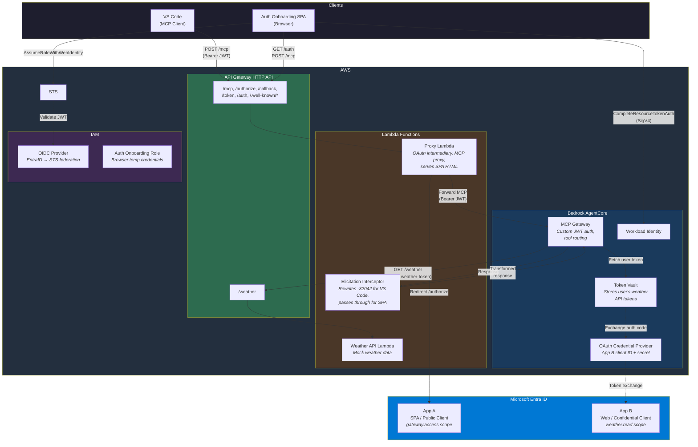
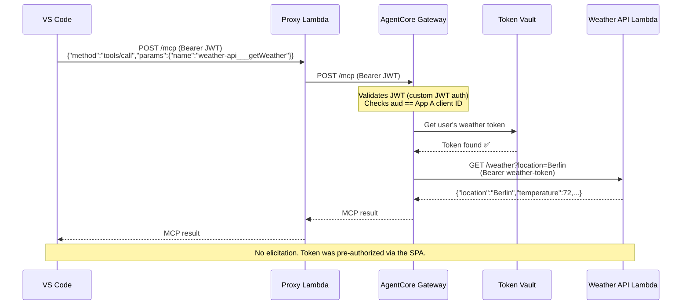
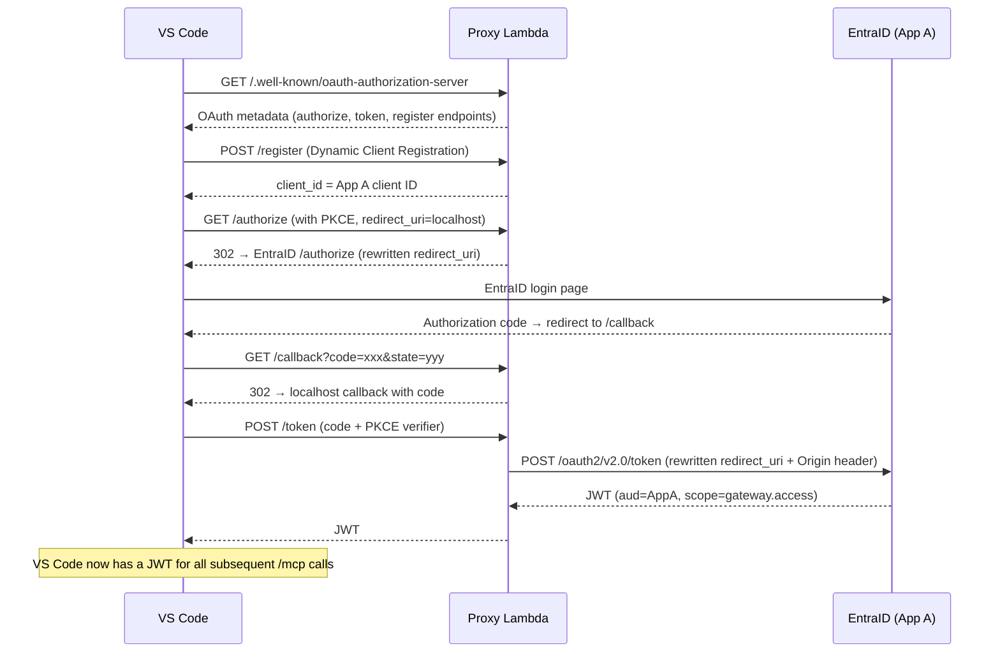

# Fluxo Ponta a Ponta: AgentCore Gateway com EntraID 3LO

Este documento descreve o fluxo completo de funcionamento do AgentCore MCP Gateway com inbound auth EntraID e outbound 3LO (OAuth de três pernas) para acesso delegado pelo usuário a APIs downstream.

## Visão Geral do Sistema

```
┌─────────────────────────────────────────────────────────────────────────┐
│                         COMPONENTS                                     │
├─────────────────────────────────────────────────────────────────────────┤
│                                                                        │
│  EntraID (CIAM tenant)                                                 │
│  ├── App A: agentcore-gateway-inbound (SPA, public client)             │
│  │   └── Shared identity for VS Code + Auth Onboarding SPA             │
│  └── App B: agentcore-weather-api (Web, confidential client)           │
│      └── Resource server exposing weather.read scope                   │
│                                                                        │
│  AWS                                                                   │
│  ├── API Gateway HTTP API (proxy endpoint)                             │
│  ├── Proxy Lambda (OAuth metadata, authorize/callback/token, MCP proxy)│
│  ├── Weather API Lambda (mock weather data)                            │
│  ├── AgentCore Gateway (MCP protocol, custom JWT auth)                 │
│  ├── AgentCore Token Vault (stores user's weather API tokens)          │
│  ├── OAuth Credential Provider (App B client ID + secret)              │
│  ├── IAM OIDC Provider (EntraID → STS federation)                      │
│  └── IAM Role: auth-onboarding-web-role (browser temp credentials)     │
│                                                                        │
│  Clients                                                               │
│  ├── VS Code (MCP client, uses proxy Lambda)                           │
│  └── Auth Onboarding SPA (browser-based, pre-authorizes 3LO)          │
│                                                                        │
└─────────────────────────────────────────────────────────────────────────┘
```

## Arquitetura AWS



## Dois Fluxos, Um Único Token Vault

Existem dois fluxos de cliente que compartilham a mesma identidade de usuário e o mesmo token vault:

1. **Auth Onboarding SPA** — aplicação web baseada em navegador onde os usuários pré-autorizam o acesso 3LO
2. **VS Code MCP Client** — cliente MCP baseado em IDE que chama ferramentas através do proxy

Ambos se autenticam contra o mesmo EntraID App A, então a claim `sub` do JWT é idêntica para o mesmo usuário. Um token autorizado via SPA é imediatamente utilizável pelo VS Code.

---

## Fluxo 1: Auth Onboarding (Primeira Autorização)

O usuário visita a aplicação web de auth onboarding para pré-autorizar o acesso a APIs downstream antes de usá-las a partir do VS Code.

```mermaid
sequenceDiagram
    participant B as Browser (SPA)
    participant EA as EntraID (App A)
    participant STS as AWS STS
    participant PL as Proxy Lambda
    participant GW as AgentCore Gateway
    participant TV as Token Vault
    participant EB as EntraID (App B)
    participant AC as AgentCore Identity

    rect rgb(30, 40, 60)
    Note over B,AC: Phase 1 — User signs in
    B->>PL: GET /auth
    PL-->>B: SPA HTML page (static)
    B->>EA: MSAL.js loginRedirect (PKCE)<br/>scope: openid profile email + gateway.access
    EA-->>B: JWT (aud=AppA, sub=user)
    Note over B: JWT stored in browser sessionStorage
    end

    rect rgb(40, 30, 60)
    Note over B,AC: Phase 2 — Check authorization status
    B->>PL: POST /mcp (Bearer JWT)<br/>{"method":"tools/call","params":{"name":"weather-api___getWeather"}}
    PL->>GW: POST /mcp (Bearer JWT)
    GW->>TV: Get user's weather token
    TV-->>GW: Not found
    GW-->>PL: Error -32042 (elicitation)<br/>authorizationUrl + session_id
    PL-->>B: Error -32042 with authorizationUrl
    Note over B: Shows "Authorization needed" + Authorize button<br/>Saves JWT + roleArn to sessionStorage
    end

    rect rgb(60, 40, 30)
    Note over B,AC: Phase 3 — User consents
    Note over B: User clicks Authorize
    B->>AC: Follow authorizationUrl
    AC->>EB: Redirect to EntraID consent<br/>scope: weather.read
    Note over EB: User sees "Allow Weather API to read weather data?"
    EB-->>AC: Authorization code
    Note over AC: Exchanges code for weather token<br/>using App B client secret
    AC->>TV: Store user's weather token
    AC-->>B: Redirect to /auth/callback?session_id=xxx
    end

    rect rgb(30, 55, 35)
    Note over B,AC: Phase 4 — Complete authorization (browser-side SigV4)
    B->>PL: GET /auth/callback?session_id=xxx
    PL-->>B: Callback HTML page (static)
    Note over B: Reads JWT from sessionStorage<br/>Reads session_id from URL
    B->>STS: AssumeRoleWithWebIdentity(JWT)
    STS-->>B: Temporary AWS credentials (1h)
    B->>AC: CompleteResourceTokenAuth(sessionUri, userToken)<br/>[SigV4 signed with temp creds]
    Note over AC: Validates JWT matches the user who initiated the flow<br/>Binds the stored token to this user<br/>(accesses Secrets Manager via FAS internally)
    AC-->>B: Success
    Note over B: Shows "Authorization Successful"
    end
```



### O que acontece em cada etapa

1. O usuário visita `https://<endpoint>/auth` — o proxy Lambda serve o HTML da SPA
2. O MSAL.js gerencia o login no EntraID via PKCE, obtendo um JWT com o escopo `gateway.access`
3. A SPA chama `POST /mcp` com `tools/call getWeather` — a mesma requisição que o VS Code faria
4. O Gateway verifica o token vault em busca do token da API de clima do usuário — não encontrado
5. O Gateway retorna elicitation (-32042) com uma `authorizationUrl`
6. A SPA exibe o botão Authorize. O usuário clica nele. O JWT e o role ARN são salvos no sessionStorage.
7. O navegador redireciona para a URL de autorização do AgentCore → página de consentimento do EntraID
8. O usuário consente. O EntraID envia o código de autorização para o callback do AgentCore
9. O AgentCore troca o código por um token de clima usando o client secret do App B (do Secrets Manager)
10. O AgentCore armazena o token no token vault e redireciona para `/auth/callback?session_id=xxx`
11. A página de callback lê o JWT do sessionStorage e chama STS `AssumeRoleWithWebIdentity` para obter credenciais temporárias da AWS
12. A página de callback chama `CompleteResourceTokenAuth` diretamente via SigV4 — sem proxy Lambda envolvido
13. Pronto. O token está no vault, vinculado a este usuário.

---

## Fluxo 2: VS Code MCP (Caminho Feliz Após Autorização)

Após o usuário ter autorizado via SPA, as chamadas MCP do VS Code funcionam sem nenhuma elicitation.



---

## Fluxo 3: OInbound Auth do VS Code (Primeira Conexão)

Quando o VS Code se conecta pela primeira vez ao servidor MCP, ele passa pelo fluxo padrão OAuth 2.1 para inbound auth. Isso é separado da autenticação outbound 3LO.



### Papel do Proxy Lambda na inbound auth

O proxy Lambda atua como intermediário OAuth entre o VS Code e o EntraID:

- `/authorize` — reescreve o `redirect_uri` para o `/callback` do proxy, codifica o redirect_uri original no parâmetro state e injeta o escopo `gateway.access`
- `/callback` — decodifica o state composto e encaminha o código de autorização para o redirect_uri original do VS Code
- `/token` — remove o parâmetro `resource` (o EntraID v2.0 não o suporta), adiciona o header `Origin` (necessário para resgate de token de SPA/cliente público) e reescreve o `redirect_uri`
- `/register` — retorna o client_id pré-registrado do App A (não é necessário registro dinâmico)

---

## Decisões de Design Importantes

### Por que `tools/call` em vez de `tools/list` para verificar o status de autorização

`tools/list` NÃO aciona a outbound auth — ele retorna a lista de ferramentas disponíveis sem precisar do token da API de clima. Somente `tools/call` (invocando efetivamente uma ferramenta) força o Gateway a buscar o token de clima, o que aciona a elicitation se o token estiver ausente.

### Por que o tipo de vendor `CustomOauth2` para o provedor de credenciais

O tenant EntraID é um tenant CIAM (External ID). Tenants CIAM usam `ciamlogin.com` para seus endpoints de token, não `login.microsoftonline.com`. O tipo de vendor `MicrosoftOauth2` gera automaticamente a URL de descoberta como `login.microsoftonline.com`, o que causa falhas na troca de tokens. `CustomOauth2` permite especificar a URL de descoberta CIAM correta explicitamente.

### Por que o navegador chama `CompleteResourceTokenAuth` diretamente (sem proxy Lambda)

A página de callback chama `CompleteResourceTokenAuth` diretamente do navegador usando assinatura SigV4 com credenciais temporárias da AWS obtidas via STS `AssumeRoleWithWebIdentity`. Isso elimina completamente o proxy Lambda do fluxo de conclusão da autorização.

A role do navegador possui `secretsmanager:GetSecretValue` condicionada por `aws:CalledVia: bedrock-agentcore.amazonaws.com` — o navegador não pode chamar GetSecretValue diretamente, mas quando o AgentCore o chama internamente durante `CompleteResourceTokenAuth` via Forward Access Sessions (FAS), a condição é satisfeita. Esse padrão vem da política gerenciada pela AWS `BedrockAgentCoreFullAccess`.

O navegador carrega o AWS SDK v3 (`@aws-sdk/client-sts` e `@aws-sdk/client-bedrock-agentcore`) do CDN ESM do jsDelivr. O fluxo é:
1. Lê o JWT do sessionStorage (salvo antes do redirecionamento de consentimento)
2. STS `AssumeRoleWithWebIdentity(JWT)` → credenciais temporárias
3. `CompleteResourceTokenAuth(sessionUri, userToken)` com SigV4

Isso significa que o JWT nunca sai do navegador — sem DynamoDB, sem proxy Lambda, sem armazenamento no lado do servidor.

### Por que não há `allowedClients` no autorizador do Gateway

Os tokens EntraID v2.0 usam `azp` para o client ID, não `client_id`. O AgentCore valida `allowedClients` contra a claim `client_id`, que não existe nos tokens EntraID v2.0. Em vez disso, utilizamos `allowedAudience` (validado contra `aud`).

### Por que o proxy Lambda inclui seu próprio boto3

O boto3 embutido no runtime do Lambda pode estar desatualizado e não possuir `complete_resource_token_auth`. A etapa de empacotamento do CDK instala a versão mais recente do boto3 no pacote de implantação.

---

## Ciclo de Vida dos Tokens

| Token | Emitido por | Armazenado em | Tempo de vida | Usado para |
|-------|-----------|-------------|----------|----------|
| EntraID JWT (gateway.access) | EntraID App A | Browser sessionStorage (MSAL.js) | ~1 hora | Inbound Auth no Gateway, STS AssumeRoleWithWebIdentity, CompleteResourceTokenAuth |
| Credenciais temporárias AWS | STS | Memória do navegador (variável JS) | 1 hora | Assinatura SigV4 para CompleteResourceTokenAuth |
| Token da API de clima | EntraID App B | AgentCore Token Vault | Refresh token ~30 dias | Chamadas Gateway → Weather API |
| Refresh token | EntraID App B | AgentCore Token Vault | ~30 dias | Renovação automática do token de clima |

---

## Cenários de Erro

| Cenário | O que acontece | Resolução |
|----------|-------------|------------|
| Usuário ainda não autorizou | O Gateway retorna elicitation -32042 | Visite a SPA de auth onboarding e clique em Authorize |
| Token de clima expirado | O Gateway renova automaticamente usando o refresh token no vault | Transparente para o usuário |
| Refresh token expirado | O Gateway retorna elicitation -32042 novamente | Reautorize via SPA |
| URL de descoberta incorreta no provedor de credenciais | Erro `authorizationCode must not be null` durante o consentimento | Recrie o provedor de credenciais com `CustomOauth2` e a URL de descoberta CIAM |
| Redirect URI do EntraID App B incompatível | O fluxo de consentimento falha no EntraID | Atualize o redirect URI no centro de administração do Entra para corresponder à URL de callback do provedor de credenciais |
| Acesso negado no CompleteResourceTokenAuth | Condição FAS/CalledVia não satisfeita | Verifique se a role IAM possui `secretsmanager:GetSecretValue` com a condição `aws:CalledVia` para `bedrock-agentcore.amazonaws.com` |
