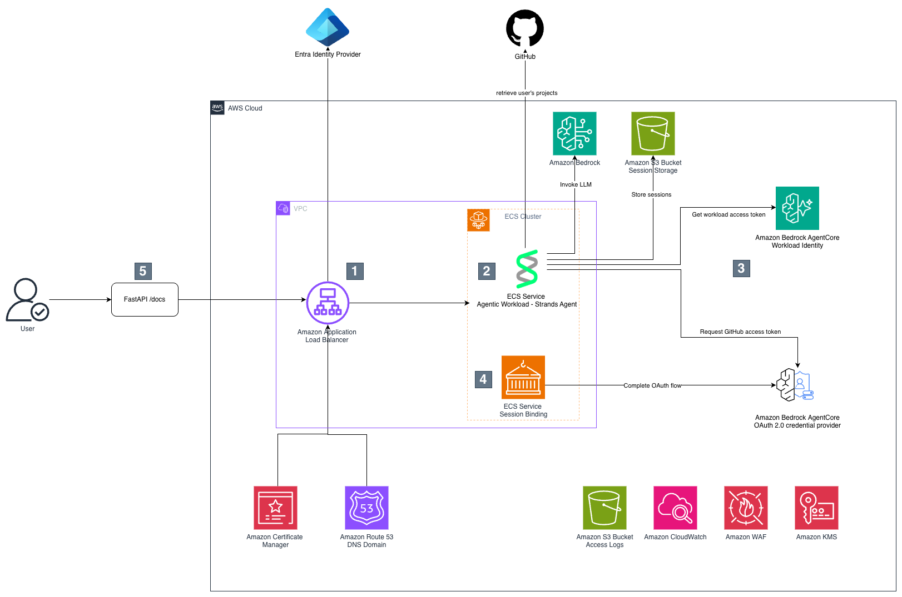
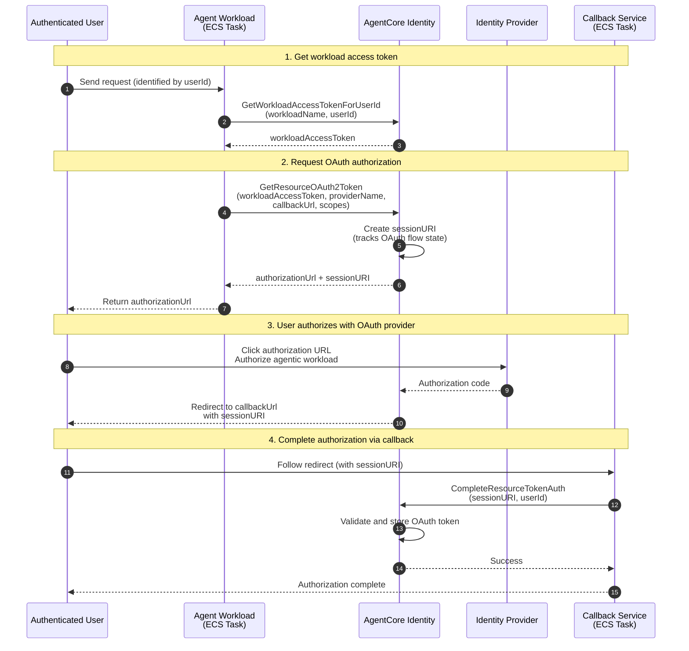

# Amazon ECS com AgentCore Identity e 3LO

Este exemplo demonstra como construir um agente de IA no Amazon ECS Fargate que usa **[Amazon Bedrock AgentCore Identity](https://docs.aws.amazon.com/bedrock-agentcore/latest/devguide/identity-getting-started.html)** para o **Fluxo Authorization Code Grant (OAuth de 3 etapas)**. O agente pode acessar com segurança serviços externos (como GitHub) em nome de usuários autenticados.

## Arquitetura




1. As requisições chegam no Amazon Application Load Balancer, que autentica o usuário usando o [fluxo de autenticação OIDC do ALB](https://docs.aws.amazon.com/elasticloadbalancing/latest/application/listener-authenticate-users.html) com [Microsoft Entra ID](https://learn.microsoft.com/en-gb/entra/fundamentals/what-is-entra) como Provedor de Identidade, embora qualquer Provedor de Identidade compatível com OIDC seja suportado. O tráfego é criptografado usando HTTPS, que requer uma zona hospedada pública no Amazon Route 53 e um certificado do Amazon Certificate Manager. Um registro A (alias) na zona hospedada roteia o tráfego para o load balancer. O load balancer fica na frente do cluster ECS com dois serviços: a Carga de Trabalho Agêntica e o OAuth Callback. O load balancer passa o cabeçalho `x-amzn-oidc-data`, que contém as reivindicações do usuário em formato JSON Web Token (JWT), permitindo a identificação única do usuário através do campo `sub`.
2. A Carga de Trabalho Agêntica é um servidor [FastAPI](https://fastapi.tiangolo.com/) com o método `/invocations`, que recebe um `sessionId` e `message` como entrada e os passa para um agente implementado usando Strands Agents, embora qualquer SDK de agente como LangChain ou LangGraph possa ser usado, já que a ingestão de requisição é tratada pelo servidor FastAPI independentemente do SDK do agente. O agente invoca o LLM no Amazon Bedrock, armazena a sessão em um bucket Amazon S3 usando a reivindicação `sub` do usuário como prefixo de chave para garantir isolamento de sessão entre usuários, e tem ferramentas para realizar ações em nome do usuário no GitHub, o que requer o token de acesso do usuário.
3. Amazon Bedrock AgentCore Identity (AC Identity) fornece uma identidade de carga de trabalho para a carga de trabalho agêntica e a configuração do provedor OAuth para GitHub, que inclui a configuração well-known do GitHub e as credenciais para a aplicação registrada no GitHub. Isso permite que o agente recupere o token de acesso do AC Identity Token Vault. Se o token de acesso não estiver disponível, tiver expirado ou tiver sido revogado, AC Identity retorna uma URL de autorização que inclui a URL de callback apontando para o serviço de callback e um ID de sessão vinculado ao usuário para identificar o fluxo.
4. O serviço de callback processa a URL de callback uma vez que a autorização pelo usuário tenha sido concedida no GitHub. Ele pega o id de sessão da URL de callback e o `sub` do cabeçalho `x-amzn-oidc-data` para completar o fluxo OAuth.
5. O usuário final invoca a carga de trabalho agêntica através do endpoint `/docs`, que renderiza a especificação OpenAPI como HTML, servindo como uma UI mínima suficiente para fins de demonstração.

Logs são capturados no Amazon CloudWatch, e logs de acesso tanto para o load balancer quanto para o bucket S3 são armazenados em um bucket S3 dedicado. As imagens de container para os serviços ECS são armazenadas e extraídas do Amazon ECR. Um conjunto de regras básicas do AWS WAF é anexado ao load balancer para fornecer proteção baseline contra explorações web comuns. Todos os dados são criptografados usando uma chave gerenciada pelo cliente (CMK) do Amazon KMS, exceto o bucket de logs de acesso, que usa criptografia gerenciada pelo Amazon S3 (SSE-S3) conforme requerido pelo serviço


### Fluxo Authorization Code Grant

Quando o agente precisa acessar um serviço externo em nome de um usuário, veja [vinculação de sessão de URL de autorização OAuth 2.0](https://docs.aws.amazon.com/bedrock-agentcore/latest/devguide/oauth2-authorization-url-session-binding.html):

1. Agente solicita um token de acesso do AgentCore Identity
2. Se nenhum token válido existir, AgentCore retorna uma URL de autorização
3. Usuário clica na URL e se autentica com o serviço externo (ex.: GitHub)
4. Serviço externo redireciona para o endpoint do OAuth Callback Service
5. OAuth Callback Service completa o fluxo chamando `complete_resource_token_auth()` para vincular o token ao usuário
6. Requisições subsequentes do agente recebem automaticamente o token de acesso do usuário

## Conceitos Chave

- **Workload Access Token**: Um token (workloadIdentityToken) usado para autenticação que representa a identidade da carga de trabalho e o usuário
- **Session URI**: Rastreia o estado do fluxo de autorização através de múltiplas requisições e respostas durante o processo de autenticação OAuth2
- **Token Vault**: Armazenamento seguro onde tokens OAuth são armazenados
- **Callback Service**: Confirma a sessão de autenticação do usuário para obter tokens OAuth2.0 para um recurso

## Fases do Fluxo

1. **Obter workload access token**: A carga de trabalho obtém um token do AgentCore Identity que representa tanto a carga de trabalho quanto o usuário
2. **Solicitar autorização OAuth**: A carga de trabalho solicita um token OAuth, recebendo uma URL de autorização
3. **Usuário autoriza com provedor OAuth**: O usuário concede permissão para a carga de trabalho acessar seus recursos na ferramenta de terceiros
4. **Completar autorização via callback**: O serviço de callback confirma a sessão de autenticação do usuário e completa a vinculação do token



Para diagramas de fluxo mais detalhados, veja:
- [Fluxo de Autenticação de Entrada](docs/inbound-pt.md) - Autenticação OIDC do ALB com Entra ID
- [Fluxo de Autorização de Saída](docs/outbound-pt.md) - OAuth do GitHub com AgentCore Identity

## Pré-requisitos

Antes de implantar este exemplo, garanta que você tem:

- [AWS CLI](https://docs.aws.amazon.com/cli/latest/userguide/getting-started-install.html) v2.27+ configurada com credenciais apropriadas
- [AWS CDK](https://docs.aws.amazon.com/cdk/v2/guide/getting-started.html) v2 instalado (`npm install -g aws-cdk`)
- [uv](https://docs.astral.sh/uv/)
- [Python 3.12+](https://www.python.org/downloads/)
- [Docker](https://docs.docker.com/get-docker/) para construir imagens de container
- Uma [Amazon Route 53](https://docs.aws.amazon.com/Route53/latest/DeveloperGuide/Welcome.html) zona hospedada para seu domínio
- Acesso ao [Amazon Bedrock](https://docs.aws.amazon.com/bedrock/latest/userguide/getting-started.html) com o modelo Claude habilitado
- Um Provedor de Identidade (IdP) compatível com OIDC para autenticação de usuário

### Provedor de Identidade OIDC

Este exemplo requer credenciais OIDC para funcionar corretamente.

#### Opcional: Criar uma Aplicação OAuth do Entra ID se você não tiver um Provedor de Identidade OIDC disponível

Crie uma aplicação OAuth no seu tenant Entra ID (Azure AD):

1. **Abrir Entra ID**: Vá para [portal.azure.com](https://portal.azure.com) e pesquise por "Microsoft Entra ID"
2. **App Registrations**: Na barra lateral esquerda, clique em Manage > App registrations
3. **New Registration**: Clique em New registration
4. **Configure o registro**:
   - **Name**: `AWS-ALB-SingleTenant` (ou seu nome preferido)
   - **Supported Account Types**: Selecione "Single tenant only"
   - **Redirect URI**:
     - Selecione "Web" do dropdown
     - Insira: `https://agent-3lo.<seu-dominio>/oauth2/idpresponse`
5. **Register**: Clique no botão Register na parte inferior

6. Após o registro, vá para Certificates & secrets
7. Clique em New client secret
8. Adicione uma descrição e defina expiração
9. Clique em Add e copie o valor do secret imediatamente (você não poderá vê-lo novamente)

No final, você deverá ter um TENANT_ID, um CLIENT_ID e um CLIENT_SECRET.

Note que os endpoints do Provedor de Identidade OIDC dependem do seu Tenant ID. O padrão exato é fornecido pela [Well Known Configuration do Entra ID](https://login.microsoftonline.com/common/v2.0/.well-known/openid-configuration). Para mais detalhes, siga o guia [Find your app's OpenID configuration document URI](https://learn.microsoft.com/en-us/entra/identity-platform/v2-protocols-oidc#find-your-apps-openid-configuration-document-uri)

Você pode usar isso na etapa de configuração abaixo.

##### Armazenar Credenciais do Cliente OIDC

Armazene o client secret e id da etapa anterior no AWS Secrets Manager:

```shell
aws secretsmanager create-secret --name "agent-oauth/credentials" \
--secret-string '{"client_id":"<seu-client-id>","client_secret":"<seu-client-secret>"}' \
--region <sua-regiao-de-implantacao>
```

### Aplicação OAuth do GitHub (para AgentCore Identity)

Crie uma Aplicação OAuth do GitHub e registre-a com AgentCore Identity seguindo o [guia de configuração do provedor de identidade GitHub](https://docs.aws.amazon.com/bedrock-agentcore/latest/devguide/identity-idp-github.html).

## Configuração

Alguns padrões são definidos em `config.py`. As credenciais DNS e OIDC são configuradas via arquivo `.env` conforme explicado abaixo.

Configurações chave do `config.py`:

| Parâmetro | Descrição | Padrão |
|-----------|-----------|--------|
| `aws_region` | Região para stack principal (ECS, ALB) | `eu-west-1` |
| `identity_aws_region` | Região para AgentCore Identity | `eu-central-1` |
| `suffix` | Sufixo para nomenclatura de recursos | `sample` |
| `inference_profile_id` | Perfil de inferência Bedrock | `eu.anthropic.claude-haiku-4-5-20251001-v1:0` |

### Configuração OIDC

Crie um arquivo `.env` na raiz do projeto com os endpoints do seu IdP. Estes valores podem ser encontrados no endpoint `.well-known/openid-configuration` do seu IdP:

```shell
cat <<EOF > .env
OIDC_ISSUER=<issuer-url>
OIDC_AUTHORIZATION_ENDPOINT=<authorization-endpoint>
OIDC_TOKEN_ENDPOINT=<token-endpoint>
OIDC_USER_INFO_ENDPOINT=<userinfo-endpoint>
OIDC_SECRET_NAME=agent-oauth/credentials
OIDC_SCOPE=openid email profile
EOF
```

<details>
<summary>Example: Entra ID (Azure AD) configuration</summary>

Replace `<TENANT_ID>` with your Entra ID tenant ID:

```shell
cat <<EOF > .env
OIDC_ISSUER=https://login.microsoftonline.com/<TENANT_ID>/v2.0
OIDC_AUTHORIZATION_ENDPOINT=https://login.microsoftonline.com/<TENANT_ID>/oauth2/v2.0/authorize
OIDC_TOKEN_ENDPOINT=https://login.microsoftonline.com/<TENANT_ID>/oauth2/v2.0/token
OIDC_USER_INFO_ENDPOINT=https://graph.microsoft.com/oidc/userinfo
OIDC_SECRET_NAME=agent-oauth/credentials
OIDC_SCOPE=openid email profile
EOF
```

</details>

### Zona Hospedada Amazon Route 53

Você precisa de uma [Amazon Route 53](https://docs.aws.amazon.com/Route53/latest/DeveloperGuide/Welcome.html) zona hospedada para seu domínio. Adicione o seguinte ao seu arquivo `.env`:

```shell
cat <<EOF >> .env
DNS_DOMAIN_NAME=seu-dominio.example.com
DNS_HOSTED_ZONE_ID=SEU-HOSTED-ZONE-ID
EOF
```


## Implantação

Use o script de implantação que valida pré-requisitos e implanta as stacks:

```shell
# Instalar dependências
uv sync --all-groups

# Executar script de implantação
./deploy_sample.sh
```

Após a implantação, acesse seu agente em `https://agent-3lo.<seu-dominio>`

## Testes

Fornecemos alguns testes em [tests](./tests/). Note que usamos [Moto](https://docs.getmoto.org/en/latest/) para simular chamadas de API do [boto3](https://docs.aws.amazon.com/boto3/latest/). Note que fazemos patch de certas chamadas de API nós mesmos pois elas ainda não estão implementadas no Moto, veja `mock_bedrock_api_call` no [conftest.py](./tests/conftest.py).

Você pode executar o teste com o comando `uv run pytest tests`.

## Segurança

- Todos os secrets são armazenados no AWS Secrets Manager com referências dinâmicas
- HTTPS é imposto via ALB com certificados ACM
- IdP OIDC manipula autenticação de usuário via ALB
- AgentCore Identity gerencia tokens OAuth com segurança por usuário
- Criptografia AWS KMS para Amazon CloudWatch Logs e dados sensíveis
- Amazon VPC com subnets privadas para tarefas Amazon ECS

## Considerações de Segurança Adicionais

Veja [Considerações de Segurança](security_considerations-pt.md)

## Limpeza

Para remover todos os recursos implantados:

```shell
uv run cdk destroy --all
```

**Nota:** Você pode precisar deletar manualmente:

- Conteúdos do bucket Amazon S3 (se não estiver vazio)
- Grupos de log do Amazon CloudWatch
- Secrets do AWS Secrets Manager

## Licença

Esta biblioteca é licenciada sob a Licença MIT-0. Veja o arquivo [LICENSE](LICENSE).
