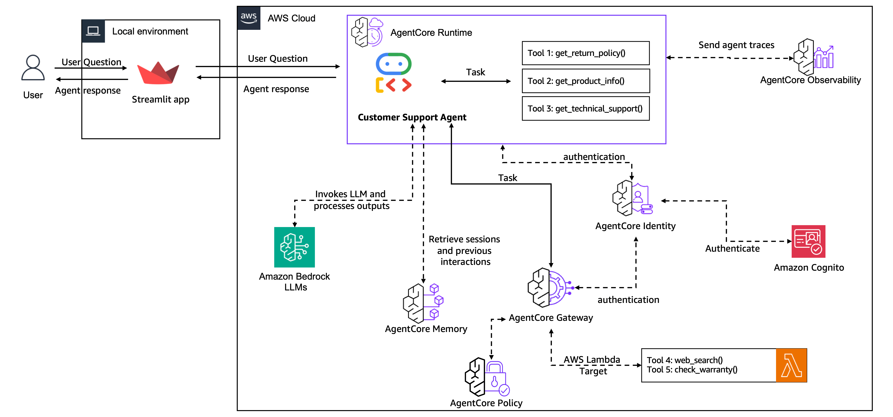

# Agente de Suporte ao Cliente End-to-End com AgentCore usando Google ADK

Neste tutorial vamos mover um agente de suporte ao cliente de protótipo para produção usando os serviços Amazon Bedrock AgentCore.

## O Que Você Vai Construir

Um sistema completo de suporte ao cliente que começa como um protótipo simples e evolui para uma aplicação de amostra escalável e segura.

Seu sistema final lidará com conversas reais de clientes com memória, ferramentas compartilhadas e uma interface web.

> [!IMPORTANT]
> Os exemplos fornecidos aqui são para fins educacionais. Ele demonstra como os diferentes serviços do AgentCore são usados no processo de migração de um caso de uso agêntico de protótipo para produção. Como tal, não é destinado para uso direto em ambientes de produção.

**Visão Geral da Jornada:**

- Comece com um protótipo básico de agente (20 min)
- Adicione memória de conversa através de sessões (20 min)
- Compartilhe ferramentas de forma segura entre múltiplos agentes (30 min)
- Implante em produção com observabilidade (30 min)
- Configure avaliação contínua de qualidade (10 min)
- Construa um aplicativo web voltado para o cliente (20 min)

## Visão Geral da Arquitetura

Ao final dos 6 laboratórios deste tutorial você terá criado a seguinte arquitetura

    

## Pré-requisitos

- Conta AWS com acesso ao Bedrock
- Python 3.10+
- AWS CLI configurado
- Claude 3.7 Sonnet habilitado no Bedrock

## Laboratórios

### Lab 1: Criar Protótipo de Agente

Construa um protótipo de um agente de suporte ao cliente com três ferramentas principais:

- Consulta de política de devolução
- Busca de informações de produtos
- Busca web para troubleshooting

**O que você vai aprender:** Criação básica de agente com Strands Agents e integração de ferramentas

### Lab 2: Adicionar Memória

Transforme seu "agente peixinho-dourado" em um que lembra dos clientes através de conversas.

- Histórico de conversa persistente
- Extração de preferências de clientes
- Consciência de contexto entre sessões

**O que você vai aprender:** AgentCore Memory para persistência de curto e longo prazo

### Lab 3: Escalar com Gateway & Identity

Migre de ferramentas locais para serviços compartilhados prontos para empresa.

- Gerenciamento centralizado de ferramentas
- Autenticação baseada em JWT
- Integração com funções AWS Lambda existentes
- (Opcional) Controle de acesso refinado com políticas Cedar

**O que você vai aprender:** AgentCore Gateway e AgentCore Identity para compartilhamento seguro de ferramentas

### Lab 4: Implantar em Produção

Implante seu agente para lidar com tráfego real com observabilidade completa.

- Implantação totalmente gerenciada
- Continuidade de Sessão e Isolamento de Sessão
- Integração com CloudWatch Observability

**O que você vai aprender:** AgentCore Runtime com observabilidade de nível de produção

### Lab 5: Construir Interface do Cliente

Crie um aplicativo web que os clientes possam realmente usar.

- Interface de chat baseada em Streamlit
- Streaming de resposta em tempo real
- Gerenciamento de sessão e autenticação

**O que você vai aprender:** Integração de frontend com endpoints seguros do agente

## Primeiros Passos

1. Clone este repositório
2. Instale dependências: `pip install -r requirements.txt`
3. Configure credenciais AWS
4. Comece com [Lab 1](lab-01-create-an-agent-pt.ipynb)

Cada laboratório constrói sobre o anterior, mas você pode pular à frente se entender os conceitos.

## Evolução da Arquitetura

Observe sua arquitetura crescer de um agente local simples para um sistema de produção:

**Lab 1:** Agente local com ferramentas incorporadas  
**Lab 2:** Agente + AgentCore Memory para persistência  
**Lab 3:** Agente + AgentCore Memory + AgentCore Gateway e AgentCore Identity para ferramentas compartilhadas  
**Lab 4:** Implantação no AgentCore Runtime e observabilidade com AgentCore Observability  
**Lab 5:** Monitoramento de qualidade de produção com AgentCore Evaluations  
**Lab 6:** Aplicação voltada para o cliente com autenticação

Pronto para construir? [Comece com Lab 1 →](lab-01-create-an-agent-pt.ipynb)
