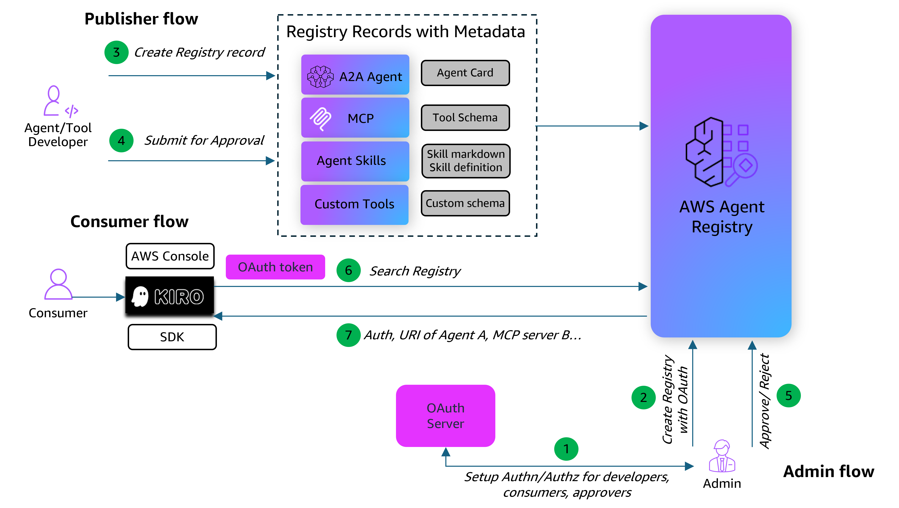

# AWS Agent Registry com Autenticação OAuth

## Visão Geral

AWS Agent Registry é um serviço de descoberta totalmente gerenciado que fornece um catálogo centralizado para organizar, curar e descobrir agentes de IA, servidores MCP, habilidades de agentes e recursos personalizados em toda a sua organização. Publicadores registram seus recursos em um registro pesquisável, curadores controlam o que é aprovado e consumidores descobrem as ferramentas e agentes certos usando busca semântica e por palavras-chave.

À medida que as organizações escalam seu uso de agentes de IA e ferramentas, descobrir o recurso certo torna-se cada vez mais difícil. Equipes constroem servidores MCP, implantam agentes e criam ferramentas especializadas — mas sem um catálogo central, esses recursos permanecem isolados e difíceis de encontrar. O Agent Registry resolve isso fornecendo descoberta centralizada, governança através de fluxos de trabalho de aprovação, tipos de recursos flexíveis, busca híbrida (semântica + palavra-chave) e autorização flexível.

### Autorização OAuth (JWT) para o Agent Registry

O Agent Registry suporta dois tipos de autorização para operações de busca: **baseada em IAM** (usando assinatura AWS SigV4) e **baseada em JWT** (usando tokens de um provedor de identidade OAuth 2.0). Autorização JWT permite que consumidores pesquisem o registro usando tokens de provedores como Amazon Cognito, Okta, Microsoft Azure AD, Auth0, ou qualquer provedor compatível com OAuth 2.0. Isso é útil quando você quer tornar o registro acessível a um amplo conjunto de usuários através de credenciais corporativas existentes, sem provisionar acesso IAM individual.

Para configurar autorização JWT, você fornece:

- **URL de descoberta** — A URL de descoberta OpenID Connect (OIDC) do seu provedor de identidade. O Agent Registry usa isso para buscar configurações de login, token e verificação.
- **Clientes permitidos** — Valores permitidos para o claim `client_id` no token JWT. Apenas tokens emitidos para clientes permitidos podem acessar o registro.

O tipo de autorização afeta apenas operações de busca. Todas as operações de gerenciamento (criar, atualizar, deletar) sempre requerem autorização IAM, independentemente da configuração de autorização do registro.

Este tutorial demonstra como configurar um Agent Registry com autenticação OAuth usando **Amazon Cognito** como provedor de identidade. Ele percorre o fluxo de trabalho completo através de três personas:

- **Administrador**: Configurar Cognito como provedor OAuth e criar um Agent Registry com autenticação baseada em JWT.
- **Publicador**: Registrar records no Agent Registry e submetê-los para aprovação.
- **Consumidor**: Autenticar via Cognito para obter um token JWT, então realizar busca semântica no Agent Registry usando o token.

### Fluxo de Arquitetura

### Detalhes do Tutorial

| Informação          | Detalhes                                                                                  |
|:---------------------|:-----------------------------------------------------------------------------------------|
| Tipo de tutorial        | Interativo                                                                               |
| Componentes AgentCore | AWS Agent Registry, Amazon Cognito                                                       |
| Tipo de autenticação            | IAM SigV4 (operações de gerenciamento), OAuth JWT (operações de busca)                         |
| Provedor de identidade    | Amazon Cognito                                                                           |
| Componentes do tutorial  | Configuração Cognito, criação de registro com OAuth, registro de records, fluxo de aprovação, busca autenticada, testes de autenticação negativa |
| Complexidade exemplo   | Intermediário                                                                             |
| SDK usado             | boto3, requests                                                                          |

### O Que Este Tutorial Cobre

1. **Configurar Provedor OAuth** — Criar um Cognito User Pool, App Client e usuário de teste para emissão de token JWT
2. **Criar Registry com OAuth** — Criar um Agent Registry com configuração de autorizador `CUSTOM_JWT`, vinculando-o à URL de descoberta do Cognito e IDs de cliente permitidos
3. **Registrar e Aprovar Records** — Como publicador, criar um record MCP no registro e percorrer o fluxo de aprovação (DRAFT → PENDING_APPROVAL → APPROVED)
4. **Autenticar** — Obter um token de acesso JWT do Cognito usando o fluxo `USER_PASSWORD_AUTH`
5. **Buscar com Token OAuth** — Como consumidor, realizar busca semântica no registro usando o token Bearer
6. **Verificar Enforcement de Autenticação** — Testes negativos para confirmar que o registro rejeita requisições sem tokens válidos
7. **Limpeza** — Deletar records do registro, o registro e recursos do Cognito

## Tutorial

- [AWS Agent Registry com Autenticação OAuth](registry-end-to-end-oauth.ipynb)
