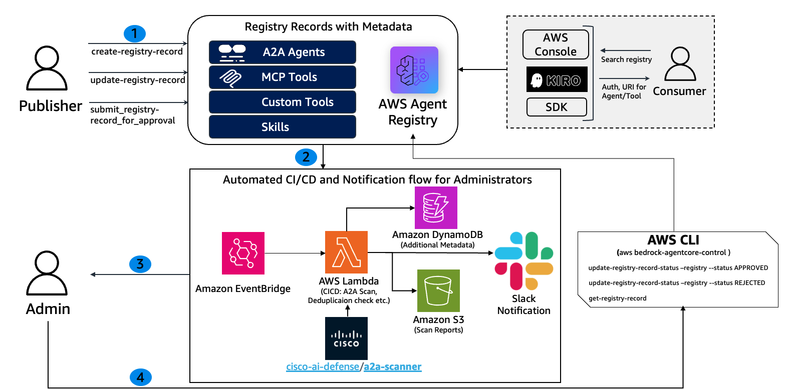
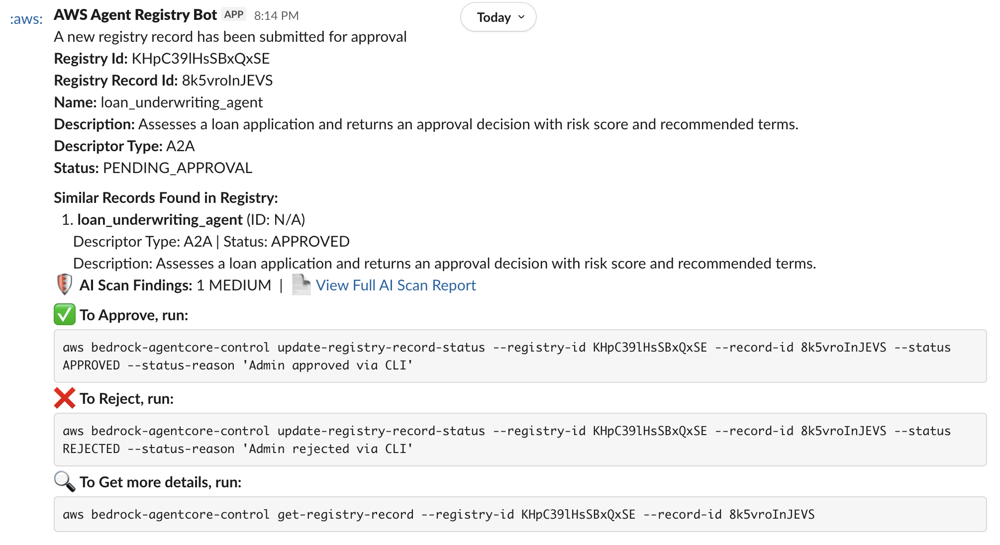

# CI/CD Admin e Fluxo de Trabalho de Aprovação para AWS Agent Registry

> [!CAUTION]
> Os exemplos fornecidos neste repositório são apenas para fins experimentais e educacionais. Eles demonstram conceitos e técnicas, mas não são destinados para uso direto em ambientes de produção.

## Visão Geral

Plataformas empresariais de agentes de IA requerem controles de governança para garantir que apenas agentes e ferramentas aprovados e seguros sejam implantados em produção. Quando múltiplas equipes publicam Agentes A2A, servidores MCP e habilidades personalizadas em um registro compartilhado, administradores precisam de pipelines automatizados para revisar, escanear e aprovar ou rejeitar submissões antes que se tornem descobríveis.

AWS Agent Registry suporta um fluxo de trabalho de aprovação voltado para governança onde os records transitam através dos estados `DRAFT → PENDING_APPROVAL → APPROVED / REJECTED`. Este tutorial constrói um pipeline CI/CD automatizado em torno desse fluxo de trabalho usando Amazon EventBridge, AWS Lambda, Amazon DynamoDB, Amazon S3 e notificações Slack, dando aos administradores uma experiência de revisão e aprovação simplificada.

### Como Funciona

Quando um publicador submete um record do registro para aprovação, uma regra EventBridge dispara uma função Lambda CI/CD que:

1. **Busca os detalhes do record** do plano de controle do Agent Registry.
2. **Busca por duplicatas** usando a API de busca semântica do Agent Registry.
3. **Executa um scan de segurança de IA** em agent cards A2A usando o Cisco AI Defense A2A Scanner, persiste achados no DynamoDB e faz upload de um relatório HTML para o S3. (Apenas records A2A — records MCP e CUSTOM pulam este passo pois o scanner é construído especificamente para análise de agent card A2A.)
4. **Envia uma notificação Slack** para administradores com metadados do record, resultados de detecção de duplicatas, resumo do scan (se aplicável) e comandos CLI para Aprovar/Rejeitar ou Obter mais detalhes.

Como Administrador, você pode usar os comandos **AWS CLI** incluídos na notificação para agir sobre o record. Consulte a [documentação](https://docs.aws.amazon.com/cli/latest/userguide/cli-chap-getting-started.html) para orientação detalhada sobre como instalar e configurar o AWS CLI. Alternativamente, você pode usar [AWS CloudShell](https://aws.amazon.com/cloudshell/) para executar comandos AWS CLI diretamente do navegador sem precisar instalar ou configurar nada.

### Exemplo de Notificação Slack

### Personas

| Persona       | Pode Fazer                                                        | Não Pode Fazer                                          |
|:--------------|:--------------------------------------------------------------|:---------------------------------------------------|
| Admin         | Criar/deletar registries, aprovar/rejeitar records              | —                                                  |
| Publisher     | Criar records, submeter para aprovação, atualizar records DRAFT     | Aprovar/rejeitar records, criar/deletar registries   |

### Tipos de Records Suportados

| Tipo     | Descrição                                      | Descritores              |
|:---------|:-------------------------------------------------|:-------------------------|
| MCP      | Servidores Model Context Protocol (ferramentas)           | `server` + `tools`       |
| A2A      | Agentes Agent-to-Agent protocol                   | `agentCard`              |
| CUSTOM   | Habilidades, recursos de API personalizados, qualquer outra coisa      | `custom`                 |

## Detalhes do Tutorial

| Informação              | Detalhes                                                                                          |
|:-------------------------|:-------------------------------------------------------------------------------------------------|
| Tipo de tutorial            | Interativo                                                                                      |
| Componentes AgentCore     | AWS Agent Registry                                                                |
| Tipos de records             | A2A, MCP, CUSTOM                                                                                 |
| Modo de aprovação            | Manual (`autoApproval: false`)                                                                   |
| Componentes do tutorial      | AWS Agent Registry, Amazon EventBridge, AWS Lambda, Amazon API Gateway, Amazon DynamoDB, Amazon S3, Slack Webhooks |
| Scanning de segurança        | Cisco AI Defense A2A Scanner (para records A2A)                                                   |
| Tutorial vertical        | Cross-vertical (aplicável a qualquer fluxo de trabalho de governança de agentes corporativos)                          |
| Complexidade exemplo       | Intermediário                                                                                     |
| SDK usado                 | boto3                                                                                            |

## Recursos-Chave do Tutorial

* Registry de agentes voltado para governança com fluxo de aprovação manual (`DRAFT → PENDING_APPROVAL → APPROVED / REJECTED`).
* Pipeline CI/CD automatizado disparado por EventBridge em mudanças de estado de records do Agent registry.
* Detecção de duplicatas usando busca semântica do Agent Registry.
* Scanning de segurança de IA de agent cards A2A com geração de relatório HTML.
* Notificações Slack com ações de aprovar/rejeitar com um clique via API Gateway.
* Implantação completa de infraestrutura como código usando CloudFormation.

## Pré-requisitos

- Credenciais IAM com permissões apropriadas (veja [`IAM_PERMISSIONS.md`](../../IAM_PERMISSIONS.md)). Este tutorial requer permissões tanto de admin quanto de publisher. Além disso, as seguintes permissões são necessárias para implantar e destruir a stack CI/CD:

  | Serviço | Permissões |
  |:--------|:------------|
  | **Amazon S3** | `CreateBucket`, `HeadBucket`, `PutPublicAccessBlock`, `DeleteBucket`, `ListBucket`, `PutObject`, `GetObject`, `DeleteObject` |
  | **AWS CloudFormation** | `CreateStack`, `UpdateStack`, `DeleteStack`, `DescribeStacks`, `CreateChangeSet`, `ExecuteChangeSet`, `DescribeChangeSet`, `DeleteChangeSet` |
  | **AWS Lambda** | `CreateFunction`, `UpdateFunctionCode`, `UpdateFunctionConfiguration`, `GetFunction`, `DeleteFunction`, `PublishLayerVersion`, `DeleteLayerVersion`, `AddPermission`, `RemovePermission` |
  | **AWS IAM** | `CreateRole`, `GetRole`, `DeleteRole`, `PassRole`, `AttachRolePolicy`, `DetachRolePolicy`, `PutRolePolicy`, `DeleteRolePolicy` |
  | **AWS EventBridge** | `PutRule`, `DescribeRule`, `DeleteRule`, `PutTargets`, `RemoveTargets` |
  | **Amazon DynamoDB** | `CreateTable`, `DeleteTable`, `DescribeTable` |
  | **AWS CloudWatch Logs** | `CreateLogGroup`, `CreateLogStream`, `PutLogEvents`, `DeleteLogGroup` |

- Python 3.9+ com `boto3` instalado
- Gerenciador de pacotes [uv](https://docs.astral.sh/uv/getting-started/installation/) (para instalar dependências python)
- Um workspace Slack com um [incoming webhook](https://docs.slack.dev/messaging/sending-messages-using-incoming-webhooks/) configurado. Anote a URL do webhook e o nome do canal.
- AWS CLI configurado com uma região padrão (`us-west-2`)

## Recursos AWS Criados

A stack CloudFormation (`cfn_eventbridge.yaml`) implanta os seguintes recursos:

| Recurso                        | Tipo                              | Propósito                                                    |
|:--------------------------------|:----------------------------------|:-----------------------------------------------------------|
| Lambda CI/CD                    | `AWS::Lambda::Function`           | Processa mudanças de estado do Agent registry, executa scans, envia notificações Slack |
| Regra EventBridge                | `AWS::Events::Rule`               | Dispara Lambda CI/CD em mudanças de estado `PENDING_APPROVAL`  |
| Tabela DynamoDB                  | `AWS::DynamoDB::Table`            | Armazena resultados de scan de IA e metadados por record             |
| Bucket S3                       | (auto-criado por `deploy.sh`)     | Armazena zip da layer Lambda e relatórios HTML de scan de IA           |
| Layer Lambda                    | `AWS::Lambda::LayerVersion`       | Empacota dependência Cisco AI A2A Scanner                   |
| Funções IAM                       | `AWS::IAM::Role`                  | Funções de execução para as funções Lambda                  |

## Instruções passo a passo

Consulte o notebook abaixo para instruções passo a passo:

- [Fluxo de Trabalho de Aprovação Admin com EventBridge](admin-approval-workflow-notebook.ipynb)
