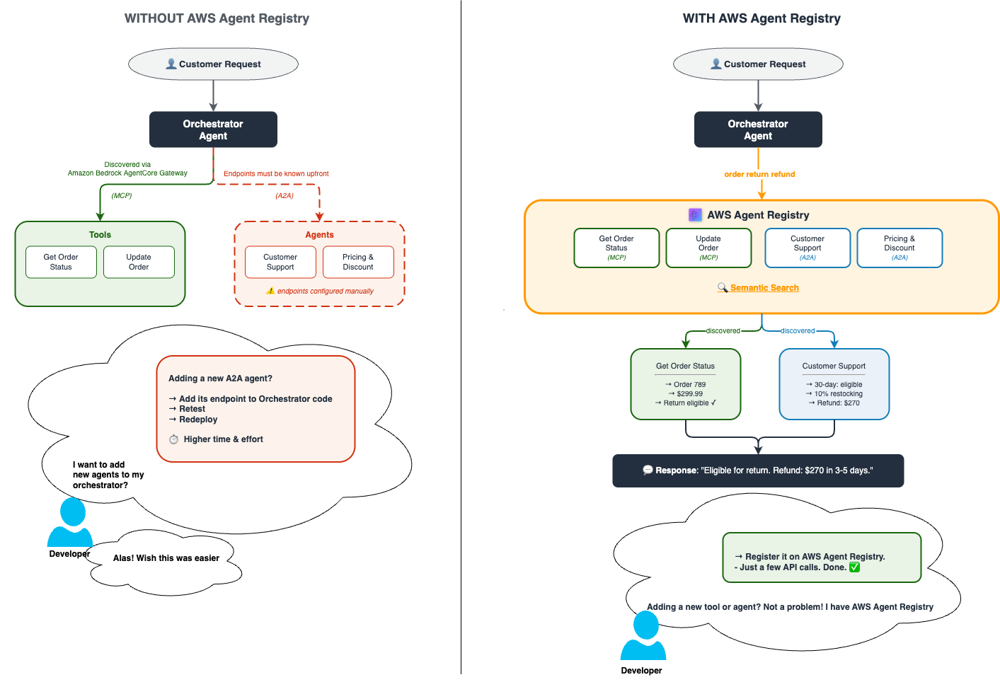
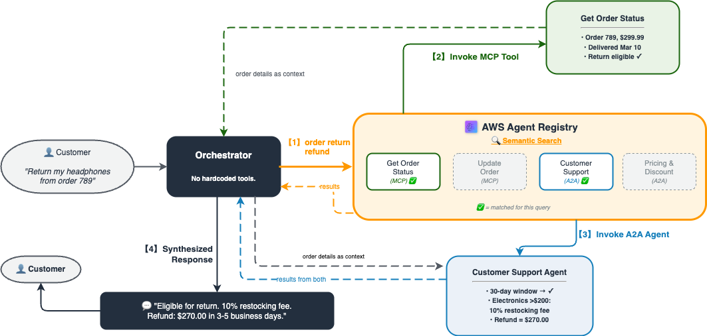
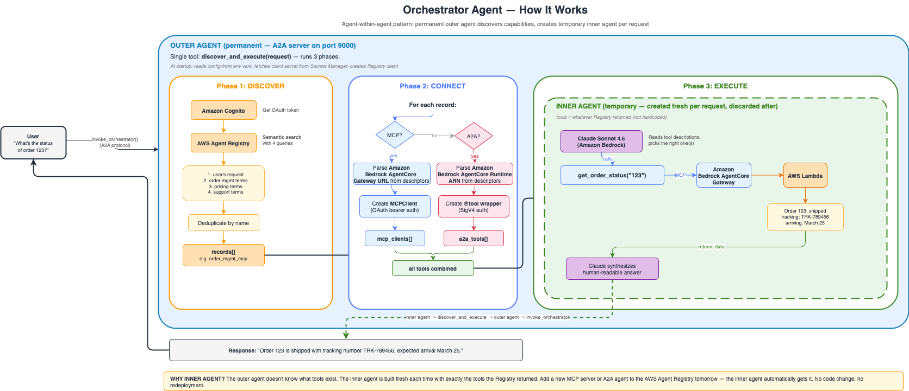

# Descobrindo Ferramentas e Agentes em Runtime Usando AWS Agent Registry

## Visão Geral

Este tutorial demonstra um agente autônomo que descobre ferramentas e agentes em runtime via busca semântica no **AWS Agent Registry** e os invoca dinamicamente — zero integrações hardcoded.

O agente orquestrador segue um padrão de descoberta de três fases:

1. **Descoberta** — Busca no Registry com linguagem natural para encontrar servidores MCP e agentes A2A relevantes
2. **Instanciação** — Cria conexões ao vivo: `MCPClient` para servidores MCP do Amazon Bedrock AgentCore Gateway, wrappers `@tool` para agentes A2A
3. **Execução** — Executa a requisição do usuário usando apenas as capacidades descobertas dinamicamente

### Descoberta Orientada por Registry

Em sistemas de agentes tradicionais, integrações são hardcoded em tempo de build. **AWS Agent Registry** inverte isso: servidores MCP e agentes registram a si mesmos em um catálogo com descrições ricas, e em runtime o orquestrador busca no catálogo com linguagem natural para encontrar o que precisa. Novas capacidades tornam-se disponíveis instantaneamente — nenhuma reimplantação necessária.



### Caso de Uso: Gerenciamento de Pedidos & Atendimento ao Cliente

Um agente orquestrador ajuda clientes com tarefas relacionadas a pedidos descobrindo dinamicamente:
- **Servidores MCP** para recuperação de dados de pedidos (obter status, atualizar pedidos)
- **Agentes A2A** para raciocínio de lógica de negócios (preços/descontos, devoluções/reembolsos)

### Detalhes do Tutorial

| Informação | Detalhes |
|:---|:---|
| Tipo de tutorial | Descoberta Agêntica & Orquestração Multi-Agente |
| Componentes AgentCore | AWS Agent Registry, Amazon Bedrock AgentCore Gateway, Amazon Bedrock AgentCore Runtime |
| Framework Agêntico | Strands Agents |
| Tipo de alvo Gateway | AWS Lambda |
| Autenticação de entrada | OAuth2 (Custom JWT via Amazon Cognito) |
| Autenticação de saída | Gateway IAM Role |
| Modelo LLM | Anthropic Claude Sonnet 4.6 |
| Componentes do tutorial | AWS Agent Registry, Amazon Bedrock AgentCore Gateway (MCP/OAuth2), Amazon Bedrock AgentCore Runtime (A2A/SigV4), AWS Lambda, Amazon Cognito |
| Tutorial vertical | Cross-vertical (Gerenciamento de Pedidos & Atendimento ao Cliente) |
| Complexidade exemplo | Avançado |
| SDK usado | boto3 |

## Arquitetura do Tutorial



O orquestrador busca no Registry a cada requisição, instancia ferramentas dos resultados e executa — tudo em runtime com zero integrações hardcoded.

### Fluxo do Agente Orquestrador



O orquestrador é implantado no Amazon Bedrock AgentCore Runtime. Em cada requisição ele executa três fases — **descobre** capacidades do Registry, **conecta** a elas (MCP via Amazon Bedrock AgentCore Gateway, A2A via Amazon Bedrock AgentCore Runtime), e **executa** usando um Strands Agent criado com apenas as ferramentas descobertas.

## Recursos-Chave do Tutorial

- **Descoberta semântica** — Busca no Registry encontra capacidades por significado, não nome (por exemplo, "return refund" corresponde ao Customer Support Agent mesmo que essas palavras exatas não apareçam em seu nome)
- **Orquestração dinâmica** — Sem integrações hardcoded; o agente constrói seu conjunto de ferramentas em runtime
- **Protocolos mistos** — Servidores MCP (via Amazon Bedrock AgentCore Gateway) e agentes A2A (via Amazon Bedrock AgentCore Runtime) em um único agente
- **OAuth2 + SigV4** — Amazon Bedrock AgentCore Gateway usa autenticação JWT do Amazon Cognito; Amazon Bedrock AgentCore Runtime usa assinatura IAM SigV4
- **Descoberta agnóstica de protocolo** — Uma busca no AWS Agent Registry retorna tanto servidores MCP quanto agentes A2A
- **Ciclo de vida end-to-end** — Cria toda infraestrutura, executa demos e faz limpeza

## Pré-requisitos

- **Instância de notebook Amazon SageMaker** — Configuração recomendada:
  - Plataforma: **Amazon Linux 2**
  - Ambiente de notebook: **JupyterLab 4** (`notebook-al2-v3`)
  - Kernel: **conda_python3**
  - Tipo de instância: `ml.t3.xlarge` ou maior
- Conta AWS com acesso ao modelo Amazon Bedrock (Claude Sonnet 4.6)
- Função IAM anexada à instância do notebook com as permissões necessárias (veja abaixo)
- Python 3.10+
- boto3 >= 1.42.87

### Permissões IAM Necessárias

Este tutorial cria e gerencia recursos através de múltiplos serviços AWS. Anexe a seguinte política IAM à função de execução da instância do notebook SageMaker:

```json
{
    "Version": "2012-10-17",
    "Statement": [
        {
            "Sid": "BedrockAgentCoreAccess",
            "Effect": "Allow",
            "Action": "bedrock-agentcore:*",
            "Resource": "*"
        },
        {
            "Sid": "BedrockModelInvocation",
            "Effect": "Allow",
            "Action": "bedrock:InvokeModel",
            "Resource": "*"
        },
        {
            "Sid": "LambdaManagement",
            "Effect": "Allow",
            "Action": [
                "lambda:CreateFunction",
                "lambda:DeleteFunction",
                "lambda:GetFunction",
                "lambda:InvokeFunction",
                "lambda:AddPermission"
            ],
            "Resource": "arn:aws:lambda:*:*:function:*"
        },
        {
            "Sid": "CognitoManagement",
            "Effect": "Allow",
            "Action": [
                "cognito-idp:CreateUserPool",
                "cognito-idp:CreateUserPoolClient",
                "cognito-idp:CreateResourceServer",
                "cognito-idp:CreateUserPoolDomain",
                "cognito-idp:DeleteUserPool",
                "cognito-idp:DeleteUserPoolDomain",
                "cognito-idp:DescribeUserPoolClient"
            ],
            "Resource": "*"
        },
        {
            "Sid": "IAMRoleManagement",
            "Effect": "Allow",
            "Action": [
                "iam:CreateRole",
                "iam:DeleteRole",
                "iam:PutRolePolicy",
                "iam:DeleteRolePolicy",
                "iam:AttachRolePolicy",
                "iam:DetachRolePolicy",
                "iam:ListRolePolicies",
                "iam:ListAttachedRolePolicies",
                "iam:PassRole"
            ],
            "Resource": "arn:aws:iam::*:role/*"
        },
        {
            "Sid": "ECRManagement",
            "Effect": "Allow",
            "Action": [
                "ecr:CreateRepository",
                "ecr:DeleteRepository",
                "ecr:GetAuthorizationToken",
                "ecr:BatchDeleteImage",
                "ecr:PutImage",
                "ecr:InitiateLayerUpload",
                "ecr:UploadLayerPart",
                "ecr:CompleteLayerUpload",
                "ecr:BatchCheckLayerAvailability"
            ],
            "Resource": "*"
        },
        {
            "Sid": "CodeBuildManagement",
            "Effect": "Allow",
            "Action": [
                "codebuild:CreateProject",
                "codebuild:UpdateProject",
                "codebuild:StartBuild",
                "codebuild:BatchGetBuilds"
            ],
            "Resource": "arn:aws:codebuild:*:*:project/bedrock-agentcore-*"
        },
        {
            "Sid": "SecretsManagerManagement",
            "Effect": "Allow",
            "Action": [
                "secretsmanager:CreateSecret",
                "secretsmanager:GetSecretValue",
                "secretsmanager:DeleteSecret"
            ],
            "Resource": "arn:aws:secretsmanager:*:*:secret:*"
        },
        {
            "Sid": "S3CodeBuildArtifacts",
            "Effect": "Allow",
            "Action": [
                "s3:CreateBucket",
                "s3:PutBucketLifecycleConfiguration",
                "s3:PutObject",
                "s3:GetObject",
                "s3:GetBucketLocation"
            ],
            "Resource": "arn:aws:s3:::bedrock-agentcore-*"
        },
        {
            "Sid": "STSAccess",
            "Effect": "Allow",
            "Action": "sts:GetCallerIdentity",
            "Resource": "*"
        },
        {
            "Sid": "CloudWatchLogs",
            "Effect": "Allow",
            "Action": [
                "logs:CreateLogGroup",
                "logs:CreateLogStream",
                "logs:PutLogEvents"
            ],
            "Resource": "arn:aws:logs:*:*:log-group:/aws/bedrock-agentcore/*"
        }
    ]
}
```

> **Nota:** Esta política segue princípios de privilégio mínimo e tem escopo para os recursos que este tutorial cria. Copie o JSON acima e anexe-o como uma política inline à função de execução da instância do notebook SageMaker.

## Visão Geral dos Tutoriais

| Notebook | Descrição |
|:---|:---|
| [discovery-and-invocation-at-runtime.ipynb](discovery-and-invocation-at-runtime.ipynb) | Tutorial end-to-end: implantar infraestrutura, criar Registry, registrar records, implantar orquestrador, executar 3 demos ao vivo e fazer limpeza |

### Estrutura do Notebook

O tutorial é organizado em cinco etapas principais:

**Etapa 1: Implantar Infraestrutura** — Cria todos os recursos backend que serão registrados no Registry:
- **Servidores MCP (via Amazon Bedrock AgentCore Gateway):** ferramentas `get_order_status` e `update_order` apoiadas por AWS Lambda, autenticadas via Amazon Cognito OAuth2
- **Agentes A2A (via Amazon Bedrock AgentCore Runtime):** Pricing Agent e Customer Support Agent como containers Docker, autenticados via IAM SigV4

**Etapa 2: Criar Registry & Registrar Records** — Cria um AWS Agent Registry com `autoApproval: False`, registra 3 records (1 MCP, 2 A2A), os aprova através do fluxo de trabalho de duas etapas (DRAFT → PENDING_APPROVAL → APPROVED) e verifica busca semântica

**Etapa 3: Implantar Agente Orquestrador** — Implanta um agente orquestrador no Amazon Bedrock AgentCore Runtime que usa `discover_and_execute` para buscar no Registry, analisar metadados em conexões ao vivo e executar a requisição do usuário

**Etapa 4: Demos End-to-End** — Três cenários demonstrando diferentes combinações de ferramentas:
1. **Status do Pedido** — Invocação apenas de servidor MCP
2. **Preços & Descontos** — Colaboração multi-agente MCP + A2A
3. **Devolução & Reembolso** — Decisão de Customer Support com agente A2A

**Etapa 5: Limpeza** — Deleta todos os recursos em ordem reversa de criação

## Primeiros Passos

1. **Criar uma instância de notebook Amazon SageMaker** com a configuração recomendada acima. Anexe uma função IAM com a política listada em [Permissões IAM Necessárias](#permissões-iam-necessárias).

2. Assim que a instância estiver **InService**, clique em **Open JupyterLab**.

3. **Fazer upload de todos os arquivos** para o diretório home do notebook:
   - `discovery-and-invocation-at-runtime.ipynb`
   - `utils.py`
   - `cleanup.py`
   - pasta `images/` (todos os arquivos PNG)

4. Abrir `discovery-and-invocation-at-runtime.ipynb` e selecionar o kernel **conda_python3**.

5. Executar as células sequencialmente — o notebook instala todas as dependências (incluindo boto3 >= 1.42.87), implanta infraestrutura, cria e popula o Registry, implanta o orquestrador, executa três demos ao vivo e faz limpeza.

## Recursos

- [Repositório de samples AgentCore](https://github.com/awslabs/agentcore-samples)
- [Documentação Amazon Bedrock AgentCore](https://docs.aws.amazon.com/bedrock-agentcore/latest/userguide/)
- [Tutoriais Amazon Bedrock AgentCore Gateway](https://github.com/awslabs/agentcore-samples/tree/main/01-tutorials/02-AgentCore-gateway)
- [Strands Agents SDK](https://github.com/strands-agents/sdk-python)
