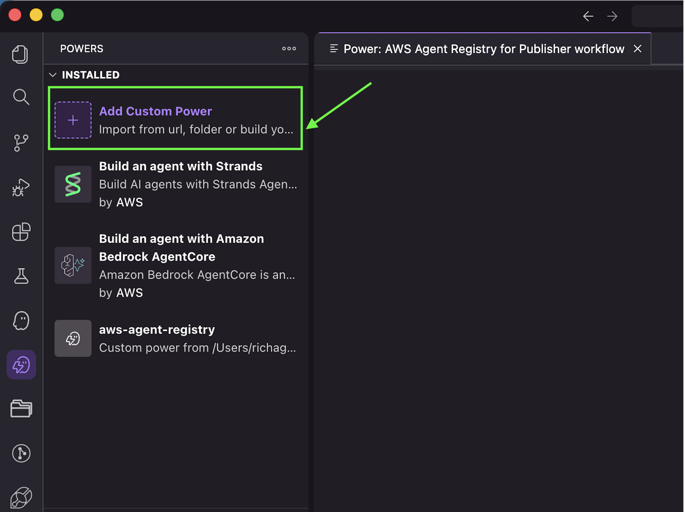
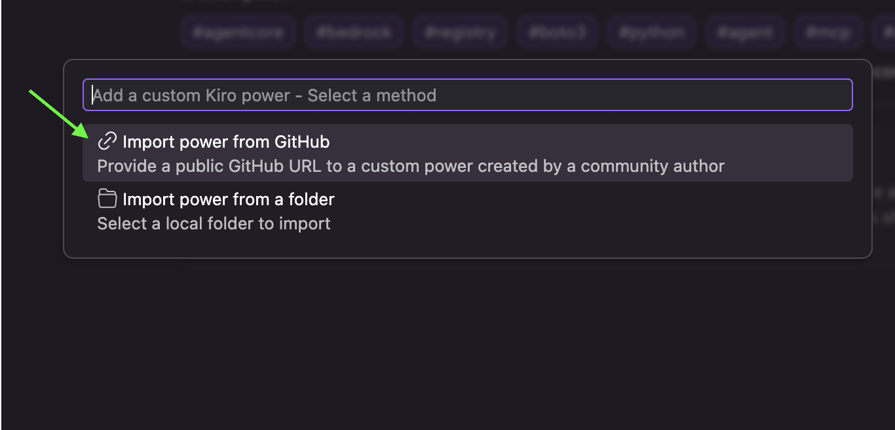
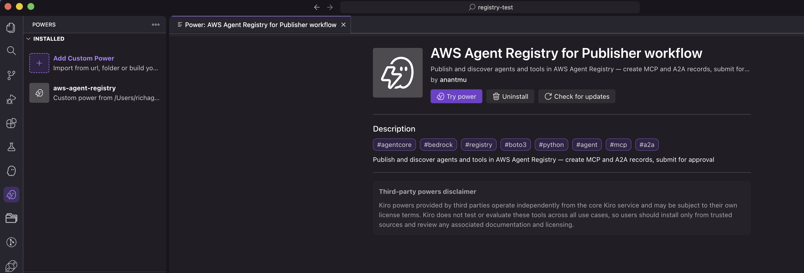

# AWS Agent Registry Kiro Power — Fluxo de Trabalho de Publisher

## Visão Geral

Kiro Powers empacotam ferramentas MCP, arquivos de steering e hooks em uma única instalação, dando aos seus agentes conhecimento especializado sem sobrecarregá-los com contexto. Saiba mais na [Documentação Kiro Powers](https://kiro.dev/docs/powers/).

Este Kiro Power habilita a **persona publisher** a criar, gerenciar e submeter records de agentes/MCP para o AWS Agent Registry.

> O fluxo de trabalho de Publisher assume que um registry já existe (criado por um admin).

### Detalhes do Tutorial

| Informação         | Detalhes                                                                 |
|:--------------------|:------------------------------------------------------------------------|
| Tipo de tutorial       | Fluxo de trabalho                                                                |
| Persona             | Publisher                                                               |
| Tipo de Power          | Conhecimento (apenas steering, sem ferramentas MCP)                                 |
| Componentes          | `POWER.md`, Arquivo de steering com orientação de fluxo de trabalho e snippets de código      |
| Operações de registry | Criar, Listar, Submeter, Deletar records de registry (MCP e A2A)             |
| Complexidade exemplo  | Intermediário                                                            |
| SDK usado            | boto3                                                                   |

### O Que um Power Inclui

- `POWER.md`: O arquivo de steering do ponto de entrada atua como um manual de integração para o agente Kiro, definindo ferramentas disponíveis e contexto de uso. Ele também define o conjunto de APIs disponíveis e inclui diretrizes de troubleshooting.
- `Steering`: Automatiza tarefas e orientação específica de fluxo de trabalho, junto com documentação de referência e exemplos de snippets de código para o power executar. Este é um power de Conhecimento, então ele tem apenas instruções.

Esses dois arquivos são empacotados juntos e carregados dinamicamente conforme a consulta do usuário.

### Arquitetura do Fluxo de Trabalho de Publisher

<div style="text-align:left">
    
</div>

### Recursos-Chave

* Operações de persona publisher para AWS Agent Registry
* Criar e gerenciar records de servidores MCP
* Criar e gerenciar records de agent card A2A
* Submeter records para aprovação de admin
* Orientação de fluxo de trabalho via arquivos de steering Kiro

---

## Ativar o Power

Instale este power diretamente no Kiro usando a URL do GitHub abaixo:

[Publisher Kiro Power para AWS Agent Registry no Github](https://github.com/awslabs/agentcore-samples/tree/main/01-tutorials/10-Agent-Registry/01-advanced/kiro/kiro-power-publisher-workflow/aws-agent-registry)

No Kiro, abra o painel Powers, selecione "Add Custom Power -> Import Power from Github" e cole o link acima.

<div style="text-align:left">
    
</div>

<div style="text-align:left">
    
</div>

<div style="text-align:left">
    
</div>

---

## Pré-requisitos

### 1. AWS CLI instalado

```bash
aws --version
# Esperado: aws-cli/2.x.x ...
```

[Instalar AWS CLI](https://docs.aws.amazon.com/cli/latest/userguide/install-cliv2.html)

---

### 2. boto3 instalado

```bash
pip install boto3
```

---

### 3. Identidade AWS configurada com permissões de persona publisher

Sua identidade AWS precisa de permissão para executar operações de registry. Use o método que corresponde à sua configuração:

Opção A — perfil nomeado:
```bash
aws configure --profile <SEU_PERFIL>
```

Opção B — chaves de acesso de usuário IAM (variáveis de ambiente):
```bash
export AWS_ACCESS_KEY_ID=sua_chave_de_acesso
export AWS_SECRET_ACCESS_KEY=sua_chave_secreta
export AWS_DEFAULT_REGION=sua_regiao
```

Opção C — função IAM — credenciais são obtidas automaticamente

Verifique se sua identidade resolve corretamente:
```bash
aws sts get-caller-identity
# Esperado: retorna AccountId, Arn, UserId
```

---

### 4. Política de persona publisher

Para executar operações do AWS Agent Registry para fluxo de trabalho de publisher, crie uma função IAM com a seguinte política:

```json
{
  "Version": "2012-10-17",
  "Statement": [
    {
      "Sid": "RegistryPublisherPermission",
      "Effect": "Allow",
      "Action": [
        "bedrock-agentcore:ListRegistries",
        "bedrock-agentcore:GetRegistry",
        "bedrock-agentcore:CreateRegistryRecord",
        "bedrock-agentcore:ListRegistryRecords",
        "bedrock-agentcore:GetRegistryRecord",
        "bedrock-agentcore:DeleteRegistryRecord",
        "bedrock-agentcore:UpdateRegistryRecord",
        "bedrock-agentcore:SubmitRegistryRecordForApproval"
      ],
      "Resource": ["*"]
    }
  ]
}
```

> Nota: Publishers não podem `CreateRegistry`, `DeleteRegistry` ou aprovar/rejeitar records — essas são operações exclusivas de admin.

---

### 5. Política de confiança IAM para assumir a função de publisher

Para assumir a função IAM de publisher, seu usuário IAM deve ter permissão `sts:AssumeRole`, e a política de confiança da função alvo deve permitir seu usuário como principal. Consulte a documentação AWS sobre [como configurar políticas de confiança](https://docs.aws.amazon.com/IAM/latest/UserGuide/id_roles_create_for-user.html) e [como assumir uma função](https://docs.aws.amazon.com/IAM/latest/UserGuide/id_roles_use.html) para instruções de configuração.

---

## Próximos Passos

Uma vez que os pré-requisitos são atendidos, você está pronto para usar o **AWS Agent Registry** Kiro Power para o fluxo de trabalho de publisher.

---

## Prompts de Exemplo

> Dica: Se você está em uma única sessão Kiro IDE, não precisa mencionar o nome do registry toda vez — Kiro o lembra do contexto.

1. "List all registries in my account in the us-west-2 region"
2. "Show me the list of records in registry `<REGISTRY-NAME>`"
3. "Create a new MCP server record in registry `<REGISTRY-NAME>` for my `<YOUR-TOOL>`"
4. "Create an A2A agent card record for my `<YOUR-AGENT>` in registry `<REGISTRY-NAME>`"
5. "Show all records in `PENDING_APPROVAL` state"
6. "Submit all records in `DRAFT` status for approval in registry `<REGISTRY-NAME>`"
7. "Show me the details of record `<RECORD-ID>`"
8. "Update the description of record `<RECORD-ID>` in registry `<REGISTRY-NAME>`"
9. "Delete all records in registry `<REGISTRY-NAME>`"
