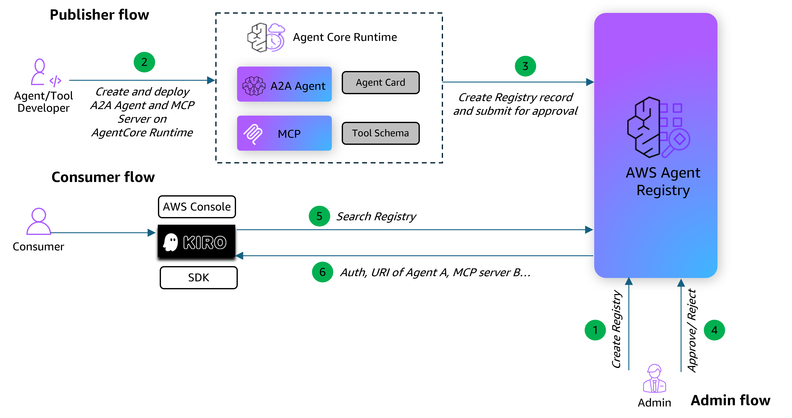

# Publicando Ferramentas AgentCore no AWS Agent Registry

## Visão Geral

Quando organizações operam dezenas ou centenas de agentes de IA, servidores MCP e ferramentas, acompanhar o que existe, quem é o proprietário e se está aprovado para uso torna-se um problema real. Equipes acabam reconstruindo capacidades que já existem em outro lugar, e recursos são implantados sem supervisão adequada. AWS Agent Registry, parte do Amazon Bedrock AgentCore, dá às equipes de plataforma um catálogo centralizado para organizar, governar e compartilhar agentes de IA, servidores MCP, habilidades de agentes e recursos personalizados em toda a organização.

Cada entrada no registry é um record estruturado que captura o que o agente ou ferramenta faz, qual protocolo usa, como invocá-lo e quem o publicou. O registry trabalha nativamente com **MCP** (Model Context Protocol) e **A2A** (Agent-to-Agent), e também suporta habilidades de agentes e tipos de recursos personalizados para qualquer coisa que não se encaixe em um protocolo padrão.

## Fluxo de Arquitetura

Este tutorial cobre o fluxo de trabalho end-to-end através de duas personas usando um caso de uso de Gerenciamento de Pedidos:

- **Publisher**: Construir um agente A2A e um servidor MCP para Gerenciamento de Pedidos, implantar ambos no AgentCore Runtime, verificar que estão funcionando, depois registrá-los no Agent Registry com as estruturas de descritor corretas e submeter para aprovação.
- **Consumer**: Uma vez que os records são aprovados, realizar busca semântica no Agent Registry para descobrir os agentes e ferramentas registrados usando consultas em linguagem natural.

### Como a Descoberta Funciona

O registry fornece busca híbrida que combina correspondência por palavra-chave e semântica. Todas as consultas usam correspondência por palavra-chave, mas consultas mais longas em linguagem natural também usam compreensão semântica para apresentar resultados conceitualmente relacionados. Isso significa que uma busca por "cancel an order" apresenta ferramentas relacionadas a gerenciamento de pedidos, mesmo que tenham nomes diferentes. A descoberta torna-se o caminho de menor resistência — equipes buscam primeiro no registry, e se uma capacidade aprovada existe, elas a usam.

### Como a Governança Funciona

Cada record segue um fluxo de aprovação: records começam como **DRAFT**, movem para **PENDING_APPROVAL** e tornam-se descobríveis pela organização mais ampla uma vez **APPROVED**. Admins usam políticas IAM para definir quem pode registrar agentes e quem pode descobri-los. Records são versionados para rastrear mudanças ao longo do tempo, e organizações podem deprecar records que não estão mais em uso.

### Tipos de Descritor de Record do Registry

| Tipo de Descritor | Protocolo | O Que Contém |
|:----------------|:---------|:-----------------|
| `MCP` | Model Context Protocol | `serverSchema` (metadados do servidor, pacotes, transporte) + `toolSchema` (definições de função individual com JSON Schema) |
| `A2A` | Agent-to-Agent | `agentCard` (identidade do agente, capacidades e descrições de habilidades em linguagem natural) |
| `AGENT_SKILLS` | Agent Skills | `skillMd` (instruções SKILL.md) + `skillDefinition` (repositório, pacotes) |
| `CUSTOM` | Custom | `inlineContent` (JSON de forma livre para qualquer tipo de recurso) |

### Detalhes do Tutorial

| Informação          | Detalhes                                                                                  |
|:---------------------|:-----------------------------------------------------------------------------------------|
| Tipo de tutorial        | Interativo                                                                               |
| Componentes AgentCore | AgentCore Runtime, AWS Agent Registry                                                    |
| Framework Agêntico    | Strands Agents (A2A), FastMCP (MCP)                                                      |
| Protocolos cobertos    | MCP (Model Context Protocol), A2A (Agent-to-Agent)                                       |
| Autenticação de entrada         | IAM SigV4                                                                                |
| Modelo LLM            | Modelo Bedrock padrão (apenas agente A2A)                                                   |
| Componentes do tutorial  | Construir agentes, implantar no runtime, criar registry, registrar records, fluxo de aprovação, busca semântica |
| Tutorial vertical    | Gerenciamento de Pedidos                                                                         |
| Complexidade exemplo   | Intermediário                                                                             |
| SDK usado             | boto3, bedrock-agentcore-starter-toolkit                                                 |

### O Que Este Tutorial Cobre

1. **Construir** — Criar um servidor MCP e um agente A2A para Gerenciamento de Pedidos com ferramentas para criar, atualizar, cancelar e rastrear pedidos
2. **Implantar** — Implantar ambos no AgentCore Runtime (MCP na porta 8000, A2A na porta 9000)
3. **Verificar** — Confirmar que os agentes estão funcionando via MCP `tools/list` + `tools/call` e A2A agent card + `message/send`
4. **Registrar** — Criar um Agent Registry, registrar ambos os agentes com as estruturas de descritor corretas (`serverSchema` + `toolSchema` para MCP, `agentCard` para A2A)
5. **Aprovar** — Percorrer o fluxo de aprovação (DRAFT → PENDING_APPROVAL → APPROVED)
6. **Descobrir** — Como consumidor, realizar busca semântica para encontrar os agentes e ferramentas registrados por consultas em linguagem natural

## Tutorial

- [Publicando Agente A2A e Servidor MCP no AWS Agent Registry](publish-agentcore-a2a-mcp-in-registry.ipynb)
