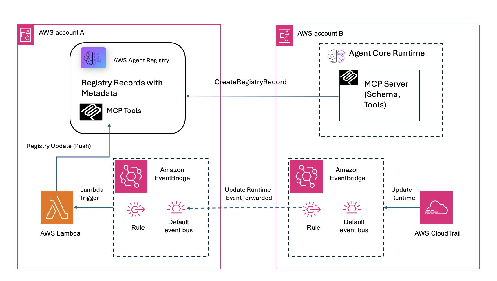

# Sincronizando Metadados com o AWS Agent Registry

## Visão Geral

Existem duas maneiras de manter os metadados de servidores MCP e A2A sincronizados com o AWS Agent Registry: baseada em pull e baseada em push.

Com uma abordagem baseada em pull, o registry alcança os servidores subjacentes para buscar seus metadados diretamente. Isso requer que o registry tenha credenciais para acessar a camada de dados de cada servidor. Essas credenciais podem expirar, e compartilhá-las com o registry pode não ser desejável do ponto de vista de segurança.

Com uma abordagem baseada em push, desenvolvedores enviam metadados para o registry sempre que seus servidores mudam. Isso mantém as credenciais seguras — o registry nunca precisa de acesso direto aos recursos subjacentes. Também habilita um pipeline de governança que dá melhor controle sobre o que é publicado. O trade-off é monitorar mudanças (tipicamente via eventos CloudTrail), e se um desenvolvedor perde o processamento de um evento, o registry pode ficar fora de sincronia.

Este notebook foca na abordagem baseada em push para Sincronização de Metadados. Ele implanta uma função Lambda que escuta eventos CloudTrail `UpdateAgentRuntime` via Amazon EventBridge, conecta ao servidor MCP para descobrir suas ferramentas atuais e atualiza o record do registry correspondente se quaisquer ferramentas foram adicionadas, removidas ou modificadas. Credenciais OAuth são gerenciadas de forma segura através do AgentCore Identity, o que significa que nenhum client secret precisa ser armazenado em variáveis de ambiente Lambda.

A solução suporta arquiteturas tanto de conta única quanto de contas cruzadas.

Note que o Lambda lida com a lógica de negócio de detectar e enviar mudanças de ferramentas. O notebook inclui passos para criar o registry e registrar o record do servidor MCP, mas estes também podem ser feitos separadamente se você já tiver um registry configurado. 
Veja a seção [Limitações Conhecidas](#limitações-conhecidas) para detalhes sobre comportamento de versionamento e aprovação.

## Pré-requisitos

- Uma conta AWS com credenciais IAM que têm permissões para criar funções Lambda, funções IAM e regras EventBridge. Também deve ter uma política que permite funções necessárias do AWS Agent Registry.
- Um servidor MCP implantado no AgentCore Runtime com Cognito OAuth configurado para autenticação.
- O notebook ajuda a criar Agent Registry e record de servidor MCP nele. Caso o Registry ou record MCP já existam, essas células podem ser puladas.
- Python 3.10+ com boto3 instalado (o notebook cuida da instalação via `requirements.txt`).
- Para configurações de contas cruzadas, perfis AWS CLI configurados tanto para Conta A quanto para Conta B.

## Arquitetura

O diagrama mostra o fluxo de evento end-to-end de uma atualização do AgentCore Runtime na Conta B através do encaminhamento do EventBridge para a Conta A, onde a função Lambda consulta o servidor MCP por suas ferramentas e atualiza o record do registry correspondente. Para implantações de conta única, o passo de encaminhamento de contas cruzadas é pulado e os eventos fluem diretamente dentro da Conta A.

Esta solução envolve dois tipos de contas AWS:

- **Conta A (Conta do Registry)** possui o AWS Agent Registry, a regra EventBridge, a função Lambda de push sync e CloudWatch Logs.
- **Conta B (Conta do Servidor MCP)** hospeda o runtime do servidor MCP e o provedor OAuth Cognito usado para autenticação.

Para implantações de conta única, todos os recursos residem na Conta A e o passo de encaminhamento de contas cruzadas não é necessário.

### Componentes

Os seguintes serviços AWS são usados nesta solução:

- **CloudTrail** captura chamadas de API `UpdateAgentRuntime` em ambas as contas.
- **EventBridge** roteia eventos para a função Lambda. Em configurações de contas cruzadas, a Conta B encaminha eventos para o barramento de evento padrão da Conta A.
- **Lambda** processa os eventos, consulta o servidor MCP por suas ferramentas e atualiza o registry.
- **AWS Agent Registry** armazena records de servidores MCP junto com seus tool schemas.
- **AgentCore Identity** gerencia credenciais OAuth de forma segura através de identidades de carga de trabalho e provedores de credenciais, eliminando a necessidade de armazenar secrets em variáveis de ambiente Lambda.
- **Amazon Cognito** serve como provedor OAuth para autenticação de servidor MCP em cada conta.

## Guia de Configuração

Todos os recursos podem ser implantados usando o notebook `deploy_lambda_push_sync.ipynb`. As células devem ser executadas em ordem, pois cada seção constrói sobre a anterior.

| Seção do Notebook | O Que Faz |
|-----------------|--------------|
| 0. Instalar Dependências | Instala boto3 e botocore do requirements.txt. |
| 1. Configuração | Define a região AWS, nome do Lambda, nome do registry, detalhes do servidor MCP, nomes de provedores de credenciais por conta e IDs de contas cruzadas. |
| 2. Criar Registry | Cria um AWS Agent Registry e aguarda ficar READY. |
| 3. Criar Record do Registry | Cria um record de registry para o servidor MCP com o ARN do runtime no schema do servidor. |
| 3.1 Aprovar Record | Move o record através de DRAFT → PENDING_APPROVAL → APPROVED para que o Lambda possa sincronizar com ele. |
| 4. Criar Provedores de Credenciais AgentCore Identity | Cria uma identidade de carga de trabalho para o Lambda e provedores de credenciais OAuth2 para cada conta de servidor MCP. |
| 5. Criar Função IAM para Lambda | Cria a função de execução Lambda com permissões para acesso ao registry, AgentCore Identity e Secrets Manager. |
| 6. Construir e Criar Lambda | Empacota `handler.py` junto com `boto3`, `botocore` e `requests` em um zip, então cria ou atualiza a função Lambda. |
| 7. Criar Regra EventBridge | Cria uma regra EventBridge que corresponde a eventos CloudTrail `UpdateAgentRuntime` e tem como alvo a função Lambda. |
| 8. Configuração de Contas Cruzadas (opcional) | Concede permissão à Conta B para enviar eventos ao barramento da Conta A, e cria a função IAM de encaminhamento e regra EventBridge na Conta B. |
| | **A implantação está completa após a seção 8. As seções abaixo são opcionais.** |
| 9. Testar o Lambda | Invoca manualmente o Lambda com um evento CloudTrail sintético. |
| 10. Checar Logs do Lambda | Exibe o stream de log CloudWatch mais recente para a função Lambda. |
| 11. Limpeza | Derruba todos os recursos criados pelo notebook, incluindo registry, records, recursos da Conta A, recursos da Conta B e recursos AgentCore Identity. |

## Limitações Conhecidas

A função Lambda atualiza records do registry existentes mas não cria novos. Um record de registry correspondente já deve existir no registry com o ARN do runtime do servidor MCP em seu campo `server.inlineContent`. O notebook cuida disso nas seções 2 e 3, mas se você pular esses passos, deve criar o record manualmente. Se nenhum record correspondente é encontrado, a sincronização é pulada.

Versionamento de records não está atualmente implementado. Quando ferramentas mudam, o Lambda atualiza o record existente no lugar independentemente da natureza da mudança. Isso significa que mudanças menores como uma atualização de descrição de ferramenta são tratadas da mesma forma que mudanças maiores como novas ferramentas sendo adicionadas, ferramentas sendo removidas ou mutações de input schema. Uma melhoria futura poderia distinguir entre mudanças de versão menores e maiores — por exemplo, criando uma nova versão de record para mudanças breaking e depreciando a mais antiga.

Quando o Lambda atualiza um record, o registry automaticamente reverte o status do record para DRAFT. Isso força uma revisão formal através do fluxo de trabalho DRAFT → PENDING_APPROVAL → APPROVED antes que as ferramentas atualizadas sejam visíveis para consumidores. Este comportamento é por design e garante que todas as mudanças passem por uma revisão de governança, mas significa que atualizações de ferramentas não estão imediatamente disponíveis até que um administrador as aprove.

## Solução de Problemas

A seguinte tabela lista problemas comuns e suas resoluções:

| Sintoma                              | Causa                                    | Correção                                                        |
|--------------------------------------|------------------------------------------|------------------------------------------------------------|
| Lambda não disparado                 | Atraso de entrega CloudTrail (5–15 min)     | Aguardar e checar métricas EventBridge.                        |
| Lambda não disparado                 | Regra de encaminhamento Conta B faltando        | Verificar se a regra existe e está ENABLED na Conta B.        |
| Lambda não disparado                 | Barramento Conta A não permite Conta B    | Executar `aws events put-permission` para Conta B.             |
| 0 ferramentas retornadas                     | Cold start do servidor MCP                    | Aquecer o servidor e tentar novamente.                              |
| Nenhum record correspondente                   | Schema do servidor faltando ARN do runtime        | Recriar o record com a URL correta em `server.inlineContent`. |
| Nenhum record correspondente                   | Record em status DRAFT                   | Aprovar o record através do fluxo DRAFT → PENDING_APPROVAL → APPROVED. |
| Erro de autenticação (secretsmanager)          | Função Lambda faltando permissão Secrets Manager | Adicionar `secretsmanager:GetSecretValue` à função Lambda.    |
| Erro de autenticação (workload token)          | Função Lambda faltando permissão identity        | Adicionar `bedrock-agentcore:GetWorkloadAccessToken` à função Lambda. |
| Erro de autenticação (provedor de credenciais)     | Nome de provedor errado para conta          | Checar variável de ambiente `CREDENTIAL_PROVIDER_{ACCT_ID}` no Lambda. |
| Falha de atualização do registry                | Função Lambda faltando permissões          | Adicionar `bedrock-agentcore:UpdateRegistryRecord` à função Lambda. |
| `no_change` quando esperando atualização    | Ferramentas são idênticas                      | Verificar se nomes, descrições ou inputSchemas das ferramentas realmente diferem. |
