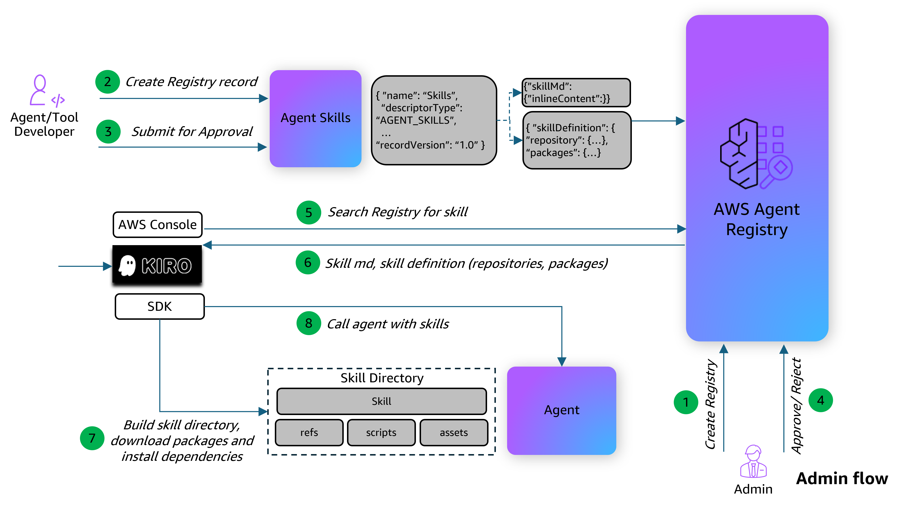

# Publicando e Descobrindo Agent Skills com AWS Agent Registry

## Visão Geral

AWS Agent Registry é um serviço de descoberta totalmente gerenciado que fornece um catálogo centralizado para organizar, curar e descobrir agentes de IA, servidores MCP, habilidades de agentes e recursos personalizados em toda a sua organização. Publicadores registram seus recursos em um registry pesquisável, curadores controlam o que é aprovado e consumidores descobrem as ferramentas e agentes certos usando busca semântica e por palavras-chave.

### O Que São Agent Skills?

Uma [Agent Skill](https://agentskills.io/specification) é uma capacidade reutilizável que pode ser compartilhada entre agentes. Diferente de servidores MCP (que definem ferramentas chamáveis) ou agentes A2A (que definem comunicação autônoma agente-para-agente), skills empacotam **instruções e contexto** que ensinam um agente como realizar uma tarefa específica — incluindo documentação, scripts, referências e dependências de pacotes.

Uma skill segue uma estrutura de pasta onde apenas `SKILL.md` é obrigatório:

```
my-skill/
├── SKILL.md          # Obrigatório: instruções + metadados (YAML frontmatter + markdown)
├── scripts/          # Opcional: código executável
├── references/       # Opcional: documentação, runbooks
└── assets/           # Opcional: templates, configs, dados de exemplo
```

### Como Skills São Representadas no Agent Registry

Um record `AGENT_SKILLS` no Agent Registry contém dois descritores:

| Componente | Descrição |
|---|---|
| `skillMd` | O conteúdo completo de `SKILL.md` (YAML frontmatter + instruções markdown). Isso é indexado para busca semântica e retornado nos resultados de busca. |
| `skillDefinition` | Metadados JSON estruturados com uma referência de `repository` (por exemplo, URL do GitHub para baixar arquivos de suporte) e lista de `packages` (dependências de runtime do PyPI, npm, etc.). Validado contra o [schema Agent Skills](https://docs.aws.amazon.com/bedrock-agentcore/latest/devguide/registry-supported-record-types.html). |

### Fluxo de Arquitetura



### Descoberta Dinâmica de Skills

Este tutorial demonstra um padrão onde um agente de IA descobre e carrega skills dinamicamente do Agent Registry em runtime. O fluxo é:

1. Um agente consumidor recebe uma tarefa do usuário (por exemplo, "Create a PDF")
2. O agente busca no Agent Registry por uma skill correspondente usando busca semântica
3. O agente lê o nome e descrição da skill para decidir se é relevante
4. Se a skill corresponde, o agente baixa o pacote da skill (SKILL.md + arquivos de suporte do repositório), instala dependências e carrega as instruções
5. O agente executa a tarefa seguindo as instruções da skill

Isso habilita agentes a adquirir novas capacidades sob demanda sem serem pré-configurados com toda skill possível.

### Detalhes do Tutorial

| Informação          | Detalhes                                                                                  |
|:---------------------|:-----------------------------------------------------------------------------------------|
| Tipo de tutorial        | Interativo                                                                               |
| Componentes AgentCore | AWS Agent Registry                                                                       |
| Framework Agêntico    | Strands Agents                                                                           |
| Tipo de record          | `AGENT_SKILLS`                                                                           |
| Tipo de autenticação            | IAM SigV4                                                                                |
| Modelo LLM            | Anthropic Claude Sonnet 4                                                                |
| Componentes do tutorial  | Criar registry, registrar skill, fluxo de aprovação, busca semântica, carregamento e execução dinâmicos de skill |
| Tutorial vertical    | Processamento de PDF                                                                           |
| Complexidade exemplo   | Intermediário                                                                             |
| SDK usado             | boto3                                                                                    |

### O Que Este Tutorial Cobre

1. **Criar um Agent Registry** — Configurar um registry com aprovação manual para armazenar records de skills
2. **Registrar uma Agent Skill** — Publicar uma skill de processamento de PDF com instruções `SKILL.md` e uma `skillDefinition` referenciando o repositório GitHub da skill e dependências PyPI
3. **Aprovar o Record da Skill** — Percorrer o fluxo de aprovação (DRAFT → PENDING_APPROVAL → APPROVED) para tornar a skill pesquisável
4. **Descoberta e Execução Dinâmicas de Skill** — Construir um Strands Agent com uma ferramenta personalizada `search_and_load_skill` que busca no Agent Registry, baixa o pacote da skill correspondente, instala dependências e carrega as instruções em runtime
5. **Executar uma Tarefa** — Enviar uma requisição em linguagem natural para o agente e observá-lo descobrir, carregar e usar a skill para completar a tarefa
6. **Limpeza** — Deletar o record da skill e registry

## Tutorial

- [Agent Skills no AWS Agent Registry](registry-skills-dynamic-discovery.ipynb)
