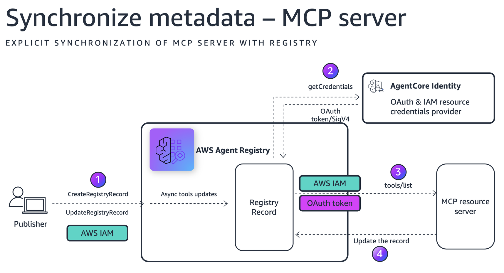

# Sincronizar Metadados de Servidor MCP para AWS Agent Registry

## Visão Geral

Este tutorial demonstra como usar a sincronização baseada em URL do AWS Agent Registry para extrair e registrar automaticamente metadados de servidores MCP (schema do servidor, ferramentas, descrições e versões) tanto de servidores MCP hospedados externamente quanto hospedados no AgentCore Runtime.

Ao invés de definir manualmente tool schemas, você fornece a URL do servidor MCP e o registry conecta ao servidor, descobre suas capacidades e cria um record de registry com os metadados extraídos.

## Primeiros Passos

Para começar com este tutorial, abra e siga o guia passo a passo no Jupyter notebook:

**[📓 registry_synchronize_mcpserver.ipynb](registry_synchronize_mcpserver.ipynb)**

O notebook contém todos os exemplos de código, configurações e instruções detalhadas necessárias para completar este tutorial.

## O Que Você Vai Aprender

* Como listar registries disponíveis e criar um novo registry com autorização IAM
* Como sincronizar um servidor MCP **público desprotegido** para o registry
* Como sincronizar um servidor MCP **protegido por OAuth** implantado no AgentCore Runtime
* Como sincronizar um servidor MCP **protegido por IAM** implantado no AgentCore Runtime
                             |
### Arquitetura do Tutorial

O diagrama abaixo mostra como o AWS Agent Registry sincroniza metadados de Servidores MCP protegidos por OAuth e protegidos por IAM.

Após a sincronização, o record será criado em status CREATING. Após cerca de dez segundos, o record transita para status DRAFT e contém descritores extraídos do servidor MCP, incluindo descritor de servidor e descritor de ferramentas. O registry também atualiza o nome, descrição e versão do record se esses valores são encontrados ao conectar ao servidor MCP.

### Recursos-Chave do Tutorial

* Sincronização baseada em URL (extração de metadados pull-based)
* Sincronização de servidor MCP público
* Sincronização de servidor MCP protegido por OAuth com Cognito
* Sincronização de servidor MCP protegido por IAM com acesso baseado em função

## Pré-requisitos

- Conta AWS com credenciais IAM que têm permissões para AWS Agent Registry, AgentCore Runtime, Cognito e gerenciamento de funções IAM
- Python 3.10+ com boto3 >= 1.42.87 (com suporte ao serviço `bedrock-agentcore-control`)
- AWS CLI v2 configurado com um perfil apropriado
- `bedrock-agentcore-starter-toolkit` para implantar servidores MCP no AgentCore Runtime

## Seções do Notebook

| Seção | O Que Faz |
|---------|--------------|
| Configuração | Instala dependências, inicializa sessão AWS e clients, cria funções auxiliares para aguardar operações assíncronas. |
| 1. Listar Registries | Lista todos os registries disponíveis na conta. |
| 2. Criar Registry | Cria um novo registry com autorização IAM e `autoApproval: False`. |
| 3. Sincronizar de Servidor MCP Público | Sincroniza metadados de um servidor MCP público desprotegido (por exemplo, AWS Knowledge MCP Server) usando sincronização baseada em URL. |
| 4. Sincronizar de Servidor MCP Protegido por OAuth | Cria um Cognito user pool e provedor OAuth, implanta um servidor MCP com autorização JWT no AgentCore Runtime e sincroniza usando credenciais OAuth. |
| 5. Sincronizar de Servidor MCP Protegido por IAM | Implanta um servidor MCP com autenticação IAM padrão no AgentCore Runtime, cria uma função IAM para invocação registry-para-runtime e sincroniza usando credenciais IAM. |
| 6. Listar Todos os Records | Lista todos os records sincronizados no registry. |
| 7. Limpeza | Deleta todos os recursos criados: records do registry, registry, runtimes, provedores OAuth, recursos Cognito, funções IAM e arquivos locais. |

## Serviços AWS Usados

| Serviço | Propósito |
|---------|---------|
| **AWS Agent Registry** | Armazena records de servidores MCP com tool schemas e metadados extraídos. |
| **AgentCore Runtime** | Hospeda servidores MCP com autenticação OAuth ou IAM. |
| **Amazon Cognito** | Fornece autenticação OAuth2 para acesso ao servidor MCP (fluxo de credenciais de cliente). |
| **IAM** | Fornece acesso baseado em função para invocação registry-para-runtime. |

## Limpeza

O notebook inclui uma seção de limpeza (Seção 7) que remove todos os recursos criados durante o tutorial:

- Records do registry e registry
- Implantações AgentCore Runtime
- Provedores de credenciais OAuth2
- Cognito user pools e domínios
- Funções e políticas IAM
- Arquivos locais gerados por `%%writefile`

Execute a célula de limpeza para evitar incorrer em cobranças contínuas.
